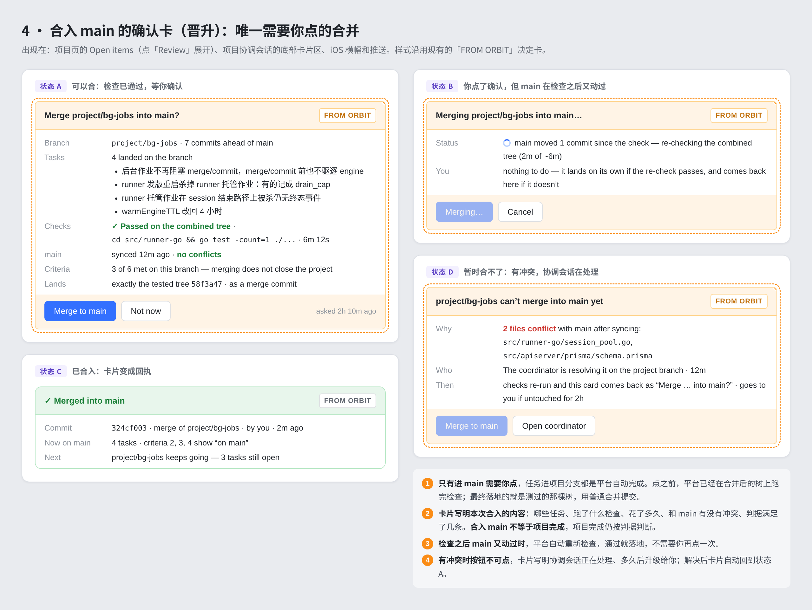

<h1 align="center">Orbit — Agent Mission Control</h1>

<p align="center"><strong>Self-hosted mission control for coding agents</strong></p>

<p align="center">
  Run coding agents on your own machines. Keep the plan, history, and controls in one self-hosted place.
</p>

<p align="center">
  <a href="https://jianghailong-xy.github.io/orbit/?utm_source=github&utm_medium=readme&utm_campaign=launch&utm_content=top-en">Public website</a> ·
  <a href="https://jianghailong-xy.github.io/orbit/zh/?utm_source=github&utm_medium=readme&utm_campaign=launch&utm_content=top-zh">中文官网</a> ·
  <a href="#quick-start">Quick Start</a> ·
  <a href="docs/90-second-demo.md">90-second demo</a> ·
  <a href="docs/launch-copy.md">Launch kit</a> ·
  <a href="examples/demo-repo/">Demo repo</a> ·
  <a href="docs/self-hosting.md">Operations</a> ·
  <a href="SUPPORT.md">Support</a>
</p>

The [public Orbit entrance](https://jianghailong-xy.github.io/orbit/?utm_source=github&utm_medium=readme&utm_campaign=launch&utm_content=intro-en)
is a concise, mobile-friendly path through the product story, 90-second demo, Quick Start, architecture and
security boundaries, FAQ, community links, and roadmap. The [简体中文入口](https://jianghailong-xy.github.io/orbit/zh/?utm_source=github&utm_medium=readme&utm_campaign=launch&utm_content=intro-zh)
contains the equivalent path; both pages offer an explicit 中文 / English switch. They point back here for the
complete operator docs and preserve the Sparkle update feed at [`appcast.xml`](https://jianghailong-xy.github.io/orbit/appcast.xml).

<p align="center">
  <a href="https://github.com/jianghailong-xy/orbit/releases"></a>
  <a href="LICENSE"></a>
  <a href="https://github.com/jianghailong-xy/orbit/actions/workflows/client.yml"></a>
</p>

Orbit is for small engineering and infrastructure teams already running coding agents against private code
or internal systems. It keeps work visible and resumable across sessions, machines, and context windows while
leaving execution on machines you choose. Individual power users coordinating several agent sessions across
machines are a good secondary audience.

**Start here:** follow [Quick Start](#quick-start), then use **Add a runner** in the web UI. The first command
installs the runner and opens the browser approval flow; once the runner is online, create a workspace for a
checkout and launch your first task.

Orbit is self-hosted. You operate the server, register runners, install and authenticate an agent runtime, and
choose the access controls, TLS, backups, and host hardening that fit your environment. It is not a managed SaaS,
a no-setup autonomous coding service, or a security sandbox.

## Three launch scenarios

These are the three ways Orbit earns its place. They are deliberately ordered to match the
[launch messaging brief](docs/messaging-brief.md) and the [90-second demo](docs/90-second-demo.md).

### 1. Work that outlives a chat

Turn a multi-day migration, refactor, or test rescue into a durable task graph. Dependencies, comments, and
session history survive context limits, restarts, and a closed browser, so the next session can continue without
reconstructing the plan.

**Show:** task list → dependency → resumable session → result and comment history.

### 2. Parallel agents without checkout collisions

Split a backlog across runners and enable a separate git worktree per session. Agents can work concurrently;
you review the diffs and choose what to merge. A worktree prevents file collisions, but it is not a security
boundary.

**Show:** two tasks dispatched → isolated worktrees → diff review → human merge decision.

### 3. Access to private infrastructure

Run a runner on a machine that already has the required repository, internal CLI, VPN, or cluster access.
Runners poll outward, and a risky command can appear as an approval card before it proceeds.

**Show:** runner inside the private network → command approval → transcript and outcome. The runner account still
has the OS access you grant it.

## See the product

[](docs/90-second-demo.md)

*UI preview from the repository's design evidence; it is an annotated product image, not a hosted-service
guarantee. The timed narration and exact claims are in the [90-second demo storyboard](docs/90-second-demo.md).*

## Quick Start

This path gets a small trusted team from a fresh Linux host to an online runner. The server is normally run with
Docker Compose; the runner can be a Linux or macOS machine with a supported coding-agent CLI. Keep the server and
runner on a private network until you have put HTTPS and host controls in place.

### 1. Start the self-hosted control plane

Requirements: Docker Engine with the Compose plugin, Git, and a machine that can build the images. Node and Go are
not required for the Compose install.

```bash
git clone https://github.com/jianghailong-xy/orbit.git
cd orbit
# Optional but recommended: pin a reviewed release, for example:
# git checkout v0.1.2-beta.138
cp .env.example .env

# Generate two independent secrets and write them to the local .env (never commit it).
jwt_secret="$(openssl rand -base64 32)"
provider_secret_key="$(openssl rand -base64 32)"
sed -i \
  -e "s|^JWT_SECRET=.*$|JWT_SECRET=\"${jwt_secret}\"|" \
  -e "s|^PROVIDER_SECRET_KEY=.*$|PROVIDER_SECRET_KEY=\"${provider_secret_key}\"|" \
  .env
unset jwt_secret provider_secret_key

docker compose up -d --build
docker compose ps
```

The build stamps the downloadable runner with the commit from the checkout. If you build from a source archive,
which carries no Git metadata, name that revision explicitly:
`ORBIT_SOURCE_SHA=<40-character commit> docker compose up -d --build`. Do not put it in `.env`, where it would
become stale after an upgrade.

The gateway listens on <http://localhost:2086> by default. The first visitor is redirected to `/setup` and
becomes the initial administrator. For a network deployment, set `PUBLIC_ORIGIN` to the external HTTPS origin
before building the web image and follow the [self-hosting hardening guide](docs/self-hosting.md) and
[security policy](SECURITY.md).

### 2. Add a runner

In the web UI, open **Infrastructure → Add → Register a machine**, choose Linux or macOS, and copy the command shown for your
deployment. The current installer is one command because it downloads the static runner and then runs
`orbit register`:

```bash
curl -fsSL http://localhost:2086/install.sh | bash
```

The command must run on the machine that has the repository, internal tools, VPN, and agent credentials. It opens
a browser approval URL (or prints one to copy); approve the machine in Orbit. The UI polls the runner list and
shows **Runner online** after the first heartbeat. If you are provisioning non-interactively, create a one-time
enrollment token with `POST /api/runners/enrollment-tokens` while signed in (the web UI has no button for it, and a
personal access token is refused) and pass it to `orbit register --token`; never put a long-lived runner token in
source control.

Useful checks on the runner are:

```bash
orbit status
orbit doctor
```

`orbit doctor` reports whether Claude Code, Codex, Kimi Code, or OpenCode is installed and signed in. Orbit does
not move those engine credentials to the control plane. Install and authenticate at least one supported runtime
on the runner before starting a task.

### 3. Create a workspace and run a first task

After the runner is online, choose **Create a workspace**, select the runner, and point the workspace at a Git
checkout. Start with the [Demo repo fixture](examples/demo-repo/) if you do not want to use a private project.
Create a task such as “run the tests and explain the result”, assign it to the workspace, and start it. The task
graph, transcript, approvals, and result remain in Orbit even if you close the browser.

For a copyable operator checklist, troubleshooting, upgrades, backups, and TLS, see [Self-hosting](docs/self-hosting.md).
For a local development install, see [Development](docs/development.md).

### What we measured on a clean host

The repository includes a dated, sanitized run record rather than an invented “five-minute install” claim:
[clean-host install and runner smoke test](docs/evidence/clean-install-2026-09-29.md). It records the exact commit,
tool versions, elapsed time, commands, online-heartbeat check, and the point where provider availability blocked
the first real task.

## What Orbit provides

| Need | Orbit's answer |
| --- | --- |
| Work that outlives a chat | Durable projects, task lists, dependencies, comments, resumable sessions, and searchable history |
| Parallel work | Optional per-session git worktrees, diff review, and an explicit human merge decision |
| Private infrastructure | Outbound-polling runners beside the repositories, CLIs, credentials, VPNs, and internal networks you choose to expose |
| Human control | Permission modes, live approval cards, status, usage, and the ability to interrupt or redirect a run |
| Several runtimes | Claude Code, Codex, Kimi Code, and OpenCode, plus configured compatible providers |
| Several screens | Responsive web UI plus native macOS and iPhone/iPad clients |

Orbit coordinates and supervises agents; it does not guarantee that an agent finishes correctly without review,
approval, or a human merge decision.

## Architecture and security

```text
Web / macOS / iOS ── REST + SSE ──▶ Control plane + PostgreSQL ◀── outbound poll ── Runner
   tasks · history · approvals          queue · audit · usage                local agent runtime
                                                                              optional git worktree
```

- **Control plane:** NestJS, Prisma, and PostgreSQL own users, workspaces, sessions, projects, tasks,
  approvals, runners, attachments, and usage.
- **Runner:** a small static Go CLI registers a machine, claims work, drives the selected local runtime, and
  reports heartbeats, transcripts, approvals, and outcomes.
- **Clients and gateway:** Vite/React web plus shared SwiftUI clients; nginx exposes the web and `/api` through
  one origin in the Compose deployment.

Runners make outbound connections; the control plane does not need inbound access to a runner. That is a network
topology, not a sandbox: agent processes inherit the runner OS account's permissions, and a worktree is file
collision isolation rather than a security boundary. Use least-privilege accounts, unique secrets, HTTPS before
network exposure, off-host backups, and a tested restore procedure. Read [Architecture](docs/architecture.md),
[Security](SECURITY.md), [Self-hosting hardening](docs/self-hosting.md), and [HUMAN_ONLY authority](docs/human-only-authority.md)
before attaching sensitive infrastructure.

## Demo repo

The [Demo repo fixture](examples/demo-repo/) is intentionally tiny: a Git checkout with a test command and a
starter task prompt. It is committed here so the onboarding path is reviewable and reproducible; copy that
directory into a standalone Git repository (or use this checkout as the workspace directory) before assigning it
to a runner. It does not require production credentials and is not a substitute for testing your own network and
permission policy.

## Read, share, and collaborate

The [long-running-work article](docs/article-durable-agent-work.md) explains how task graphs, handoff comments,
and resumable sessions keep a migration legible across context windows. The [private multi-runtime article](docs/article-private-multi-runtime-control-plane.md)
covers runner placement, approvals, worktrees, and runtime choice. For a first announcement, use the
[launch copy pack](docs/launch-copy.md); for a fact-checked partner story, start with the
[design-partner case-study template](docs/design-partner-case-study-template.md).

## FAQ

### Is Orbit hosted for me?

No. You run the control plane and PostgreSQL, and you decide where it is reachable. The included Compose gateway
is HTTP-only and intended as a starting point; put TLS and access controls in front of it before exposing it to a
network.

### Do my model or engine credentials leave the runner?

The supported coding-agent CLIs use the runner's local configuration and credentials. The control plane stores
metadata and transcripts needed for coordination; provider behavior and billing remain the provider's
responsibility. A self-hosted Codex pool is a separate control-plane feature documented in
[Self-hosting](docs/self-hosting.md).

### Is a worktree a security sandbox?

No. It reduces checkout collisions between concurrent sessions. Processes still run as the runner OS account and
can access whatever that account can access. Use a separate least-privilege host/account when the trust boundary
requires it.

### What happens if the runner or browser goes away?

The task graph and session history live in the control plane. A runner that loses heartbeats is treated as offline;
other eligible runners can continue queued work. Exact resume behavior, model features, and usage data vary by
engine and provider, so verify the behavior you need before relying on it.

### Which agent runtimes are supported?

The control plane and runner know about Claude Code, Codex, Kimi Code, and OpenCode. The runtime must be installed
and authenticated on the runner; `orbit doctor` is the first diagnostic. Feature parity is not promised across
engines.

### Can I run the server without Docker?

For contributors, yes: see [Development](docs/development.md) for Node/PostgreSQL and web/API commands. The
documented operator path is Docker Compose because it keeps the gateway, API, PostgreSQL, and backup sidecar
together.

### Which version should I run?

Orbit is a pre-1.0 open-source project under active development. Pin deployments to a tagged release and review
upgrade notes before changing versions. The latest published release receives best-effort security fixes; `main`
is a development branch and older releases are not supported.

At this commit the release story is still being reconciled: the runner source version in the root
`package.json` is `0.1.198`, while the newest repository tag is `v0.1.2-beta.138`. Treat this checkout as
development, and verify the tag, runner manifest, web image, and native artifacts together before a production
upgrade. The open issue and proposed sequence are tracked in [Project maturity and roadmap](docs/project-maturity.md).

## Roadmap (direction, not dates)

The roadmap is intentionally a set of adoption gates rather than a promise of delivery dates.

- **Now:** make the clean-install smoke test repeatable, keep the README/demo/security claims in sync, and
  reconcile one version scheme across server, web, runner, and native artifacts.
- **Next:** screenshot-led onboarding, an operator configuration reference, a public roadmap/changelog with
  checksums and upgrade notes, and stronger project-owned community/release operations.
- **Later:** recurring schedules and inbound task sources (ticket/chat ingestion), which are designed for but not
  built; v1.0 compatibility, migration, and support guarantees come only after the evidence gates are met.

See the [full maturity roadmap](docs/project-maturity.md) and the [canonical launch brief](docs/messaging-brief.md)
for the evidence required before calling a release production-ready.

## Develop locally

Contributors need Node.js 26+, Docker or PostgreSQL 16, and Go 1.27+ when changing the runner. The shortest API
and web loop is:

```bash
npm install
cp .env.example .env
npm run db:up
npm run prisma:generate
npm run prisma:migrate -w @orbit/apiserver
npm run dev:apiserver
```

In another terminal, run `npm run dev:web`. The API is on <http://localhost:3000> and Vite is on
<http://localhost:5173>; the [development guide](docs/development.md) covers tests, repository layout, and native
clients.

## Support and contribution

- Installation and usage questions: start with the [documentation index](docs/README.md), then use the
  [support guide](SUPPORT.md).
- Reproducible bugs and feature proposals: use the [GitHub issue forms](https://github.com/jianghailong-xy/orbit/issues).
- Security vulnerabilities: follow [SECURITY.md](SECURITY.md); do not publish details in a public issue.
- Contributions: read [CONTRIBUTING.md](CONTRIBUTING.md) and [GOVERNANCE.md](GOVERNANCE.md).

## Project status

Orbit is a **pre-1.0 open-source project under active development**. Pin deployments to a tagged release and
review upgrade notes before changing versions. The latest published release receives best-effort security
fixes; `main` is a development branch and older releases are not supported.

Core functionality is in place: distributed runners, interactive sessions, project coordination, task graphs,
approvals, worktree isolation, multi-runtime support, web and native clients, runner recovery, backups, and
usage reporting. Before relying on Orbit for critical production work, review the [security policy](SECURITY.md),
[self-hosting hardening guide](docs/self-hosting.md), backup runbook, and release notes. Recurring schedules
and inbound task sources are not yet built.

## Community

- Start with the [community guide](COMMUNITY.md), [public roadmap](ROADMAP.md), or [documentation index](docs/README.md).
- Ask questions, share a deployment, or discuss direction in [GitHub Discussions](https://github.com/jianghailong-xy/orbit/discussions).
- Report a reproducible bug or scoped proposal with [GitHub Issues](https://github.com/jianghailong-xy/orbit/issues); the repository's Issue Forms explain what to include.
- Pick a small, independently scoped task from the [good first issue list](https://github.com/jianghailong-xy/orbit/issues?q=is%3Aissue+is%3Aopen+label%3A%22good+first+issue%22).
- Read [CONTRIBUTING.md](CONTRIBUTING.md) and the [Code of Conduct](CODE_OF_CONDUCT.md) before participating.
- Project decisions and maintainer responsibilities are described in [GOVERNANCE.md](GOVERNANCE.md); security issues must follow [SECURITY.md](SECURITY.md), not a public issue.

Support is community-maintained and best effort; it is not an emergency channel, SLA, or enterprise support
contract. Sanitize logs and never post tokens, cookies, API keys, private hostnames, repository contents, or
runner configuration.

## License

Orbit is available under the [MIT License](LICENSE).
