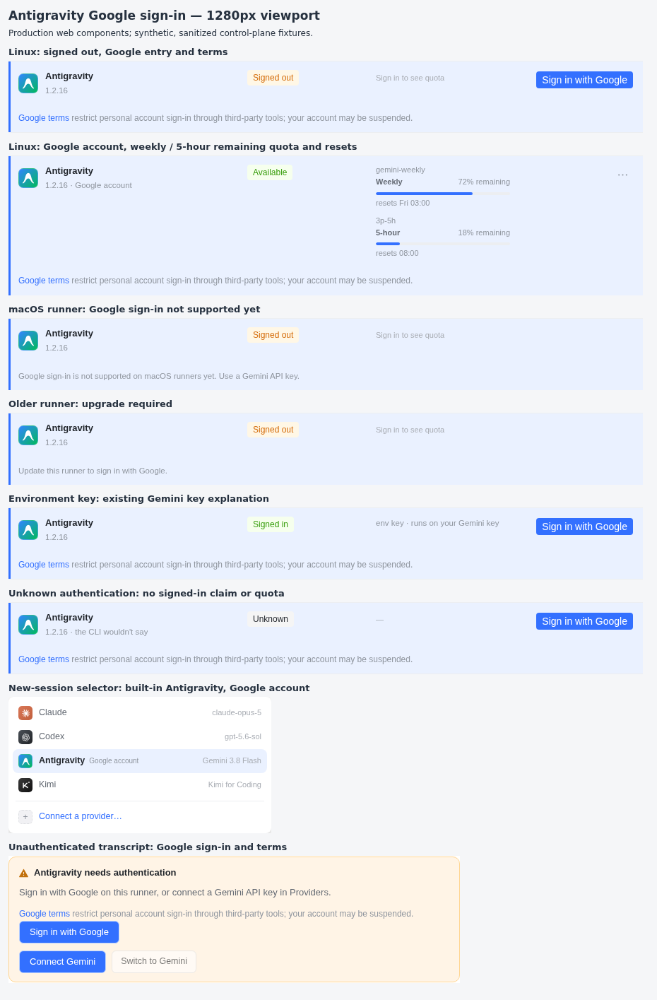
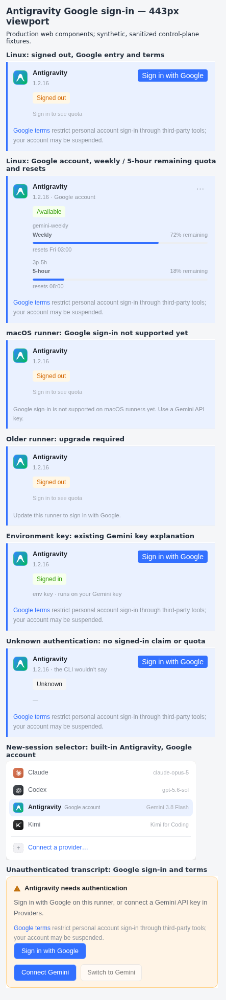

# Antigravity Google 登录：web 与 macOS/iOS 客户端证据

任务 `34ZogkzPnQ44ODj72jrYb`，对应项目验收条目 2（`4q7GDYg6GzChkJE0bfhFGV`）。
当前分支：`orbit/web-macos-ios-antigravity-google-db95c8`。
控制面契约来自第 3 步提交 `7cd0d809be5052ef1eadd2738a2217403767eeb9`，已以 `8725dd57d` 落地。

## 当前基线同步（generation 10 MAIN_SYNC，2026-10-05）

按协调会话 05:36 的评论，本轮只做基线同步，不重做客户端功能：把项目分支 tip 与当前 upstream main tip 一起吸进本任务源分支。源不再是启动时的项目 tip，而是上一已验证源 `666e679646d632f1fec7f49c295820a562e5f5a6`（它已含项目 tip，并带着四个冲突文件的解法与 main 到 `a0a76a760` 的全部改动）。

- 上一已验证源：`666e679646d632f1fec7f49c295820a562e5f5a6`
- 项目 ref `refs/heads/project/34ZoXvNg4WmQIi0AiwWmu` tip：`80e7ad8fd8ee581f5c2f66490f1966f487ad3fb6`
- upstream `refs/heads/main` tip：`aaf077310ad296c0dfeb8cfdb6b76aa367cb2f08`
- 本轮真实合并提交：`2daa7c065a663b429e20972b09e664f6faf8a5f8`，父为 `666e679646` 与 `aaf077310`；项目 tip 与 main tip 都是它的祖先。合并干净，只应用了 main 的 `OrbitLinkCardView.swift` 增量。

冲突文件由上一源解好，本轮的合并只带来 main 的增量，因此没有新的文本冲突。冲突解法的取舍沿用上一源：`AccountPauseAPIClientTests.swift`、`CodexSignInCopyParityTests.swift` 与 `origin/main` 逐字一致（保留 main 的测试修复）；`RunnerEngines.tsx` 删掉 main 入口重做里的 `AntigravityRow` 与三处特判（不显示认证状态、忽略 `auth=no`、固定 API key 文案），改用统一引擎行 + Google 登录；`SessionProviderChoices.swift` 在 main 的 `claude / codex / antigravity / kimi` 顺序上加 Google 账号选择与失效登录判断。

本轮新基线实际跑了：web 全量 `npm test -w @orbit/web`、apiserver 全量 `npm test -w @orbit/apiserver`（先 `npm run prisma:generate -w @orbit/apiserver`，4383 用例 0 失败，含 `a runner signed in with Google offers built-in Antigravity to every workspace without a key`）、OrbitKit 全量 `swift test`（含 `AntigravityGoogleClientTests` / `SessionProviderChoicesTests` / `EngineAuthTests` 共 125 条 0 失败）、`npm run build -w @orbit/web`、1280px / 443px 真实生产路由截图。上面这些工具行、HEAD 与 Orbit 附件回执以本任务会话提交的新证据信封为准。下方旧工具行及 main 既有失败对照仅保留作历史记录，不代替本次验证。

### client CI（macOS + iOS）已在精确 HEAD 上真跑并全绿

`client.yml` 由协调会话在 wikova 上对分支 `orbit/web-macos-ios-antigravity-google-db95c8` 的 HEAD `a3bde09398758f5257134b385c5c3abfd7106be2` 以 `workflow_dispatch` 触发：

- run：<https://github.com/jianghailong-xy/orbit/actions/runs/37271149367>（run 2351，event `workflow_dispatch`，head_sha `a3bde0939`，conclusion **success**）
- macOS (build + test)：**success** —— step `Test OrbitKit (macOS)` success、step `Build OrbitApp` success（都是 completed，不是 skipped）
- iOS (generate + build)：**success** —— step `Build for iOS Simulator` success
- Font tokens / Navigation：success

**为什么本会话自己不能触发**：本 HPC 没有 `gh`，也没有任何 GitHub token / 凭据（已确认 `~/.config/gh`、`~/.netrc`、`~/.git-credentials`、环境变量都没有）。`client.yml` 的 `macos` 与 `ios` 两个 job 都带 `if: github.event_name == 'pull_request' || github.event_name == 'workflow_dispatch'`（`src/macos/**` 的普通 push 只会跑两个 Linux 审计、跳过两个 Xcode job），所以本机既不能 `workflow_dispatch`，也不能靠 push 触发这两个编译门。读结果同样没有 token，本会话是直接查 GitHub 的公开 API 拿到上面这份 job/step 回执的（证据工具行 `bgj_82b5016fcd5a`）。

### 本轮工作树依赖修复（不是产品缺陷）

第一次 `npm test -w @orbit/web` 报 121 个文件、28 条失败。原因是本 worktree 的 `node_modules/@base-ui` 与 `node_modules/@floating-ui` 是指向 `/tmp/orbit-p11-final-aa737ee0/node_modules/...` 的符号链接（另一个 checkout 的安装），Node 按 realpath 解析后 `@base-ui` 会加载 `/tmp` 里那份 `react`，与本 worktree 的 `react` 不是同一个实例，触发 `Cannot read properties of null (reading 'useRef')` 等运行环境错误。把这两个包换成 worktree 内的真实拷贝、并从同一安装补上 `reselect` 等缺失依赖后重跑，失败降到 1 条（即下方 main 既有红），与干净 main 逐条一致。这是取证环境问题，已在提交说明里注明。

## 历史 main 上的冲突处理

只重放客户端实现及取证文件，保留最新 main 的控制面和 runner 改动。

- `SessionProviderChoices.swift` 保留 main 的 `claude / codex / antigravity / kimi` 顺序，加入 Google 账号选择、失效登录判断和 workspace Gemini key 回退。
- `RunnerEngines.tsx` 保留 main 的账号菜单和布局；Antigravity 使用同一引擎行、额度组件和菜单，已登录后的换号入口位于 `More actions → Re-sign in`，交互测试实际提交粘贴的授权码。
- `AccountPauseAPIClientTests.swift`、`CodexSignInCopyParityTests.swift` 及 `SharedPoolCopyParityTests.swift` 保留 main 的修复，与基线逐字一致。

未登录的 Linux runner 提供 Google 登录及条款提示；已登录时显示 Google 账号、每周 / 5 小时剩余额度与重置时间。macOS 和旧 runner 显示限制，env key 路径保留。选择器、未登录错误卡和共享原生源码同步这些状态；未知认证不显示成已登录，缺 CLI 优先显示未安装。

## 历史测试（分支 `orbit/web-macos-ios-antigravity-google-284433`）

| 检查 | 本任务会话的 Orbit 后台工具行 | 结果 |
| --- | --- | --- |
| Google 登录及 runner 账号菜单、选择器、错误卡回归 | `bgj_e9464c9b9eeb` | 退出码 0；13 文件、225 用例通过 |
| `npm test -w @orbit/web` | `bgj_5802cb7b0efe` | 退出码 1；3646 通过、30 失败，296 文件 |
| 干净 `bd688174c` 的 web 全量对照 | `bgj_8b4d04dacc81` | 退出码 1；3631 通过、同样 30 失败，295 文件 |
| `npm run build -w @orbit/web` | `bgj_2e8b71a666e0` | 退出码 0；TypeScript 与生产构建通过 |
| Swift 6.1 Docker 的 OrbitKit `swift test --jobs 2` | `bgj_9243e4215fcb` | 退出码 0；2823 用例、5 个默认跳过的性能基线、0 失败 |
| 生产构建的 Chromium 截图及原图总览 | `bgj_26c36e0b5189` | 退出码 0；1280px / 443px 共 16 张原图和 2 张总览，无浏览器异常或页面横向溢出 |
| 原图及总览的 Orbit 附件上传 | `bgj_c5073ed1f127` | 退出码 0；18 个附件均返回保存回执 |

### main 既有的 web 失败（generation 10 基线）

本分支（`2daa7c065`，308 文件 / 3883 用例 / 1 失败）与干净 `origin/main` （`aaf077310`，307 文件 / 3868 用例 / 1 失败）用同一份依赖与同一 vitest 版本各跑一遍全量，唯一的失败是同一个用例，逐字一致；本分支没有新增失败，且多出 15 条通过用例。[web-main-comparison.json](web-main-comparison.json) 记录两次运行的工具行、用例数与失败断言。

| 失败文件（`src/web/src/components/`） | 用例 | 在干净 main 上同样红 |
| --- | ---: | --- |
| `SessionReplyCard.test.tsx` | 1 | 是（`aaf077310` 上复现同一条断言 `chat-injected-action`） |

### OrbitKit 过时断言的复验

干净 main 上 `bgj_fa7d1b3bcc6f` 实际执行 1 个测试并复现 `OrbitLinkCopyParityTests.testTheStalledLineIsTheProjectsOwnSentence` 的唯一失败：项目页已经由 main 改为手动就绪提示，旧测试仍要求它携带 link card 的 stalled 文案。
本分支仅将该测试改为检查 web / Swift link card 实际共用的文案，保留四个有效断言，未改项目页行为。最终 OrbitKit 全量无失败。

## macOS/iOS 同源数据证明与编译

`AntigravityGoogleClientTests.swift` 的 9 个测试使用此目录 `fixtures.json`，与 web 测试和截图共用脱敏控制面数据。覆盖 Google 身份、weekly / 5h 剩余量（72% / 18%）及重置时间、零额度、未知 / 失效认证、Linux / macOS / 旧 runner 登录入口、选择器、两种 API key 路径、`awaiting_code` DTO、条款和共享 SwiftUI 接线。
9 个测试在本轮最终全量中全部实际执行并通过，作为任务允许的 macOS/iOS 截图替代证据。本轮在合并 HEAD `2daa7c065` 上于 Swift 6.1 容器跑全量 `swift test`：2912 用例、5 个默认跳过的性能基线、0 失败；`--filter 'AntigravityGoogleClientTests|SessionProviderChoicesTests|EngineAuthTests'` 聚焦跑 125 条、0 失败。

HPC 没有 `gh`，也没有 token。协调会话已在分支 `orbit/web-macos-ios-antigravity-google-db95c8` 的 HEAD `a3bde0939` 上以 `workflow_dispatch` 触发 `client.yml`：[run 37271149367](https://github.com/jianghailong-xy/orbit/actions/runs/37271149367)，conclusion **success**，macOS `Test OrbitKit (macOS)`、`Build OrbitApp` 与 iOS `Build for iOS Simulator` 三个 step 都实际执行成功（非 skipped）。job / step 回执见上一节与本次证据信封；历史分支的 CI 不作为本轮编译证据。

## 浏览器截图

真实生产路由 `/providers`、`/workspaces/:id/new`、`/sessions/:id` 通过 Chromium 取证，viewport 分别为 1280px 和 443px，device scale 为 1。仅 REST/SSE 输入为合成脱敏 fixture。每种宽度包含：未登录及条款、Google 账号及额度 / 重置、macOS 暂不支持、需要升级、env key、未知认证、展开的选择器、未登录错误卡。
`capture-results.json` 保存每张原图的 viewport 和可见文本；取证脚本同时核对登录按钮、条款链接、两条重置时间、Google 账号选择器与不支持平台的无登录入口。

总览按原尺寸排列原图，全部原图保留在 `screenshots/` 并已上传 Orbit。复跑需安装 Playwright / Chromium，先构建 shared 和 web，再启动 `npm run preview -w @orbit/web -- --host 127.0.0.1 --port 4184 --strictPort`，运行 `ORBIT_EVIDENCE_WEB_URL=http://127.0.0.1:4184 node docs/evidence/antigravity-google-login/clients/capture.mjs` 和 `contact-sheets.mjs`。

真实 Google 账号授权、实时额度和推送通知的端到端验证由项目第 5 步持有；本客户端证据没有宣称这些实验已经执行。
