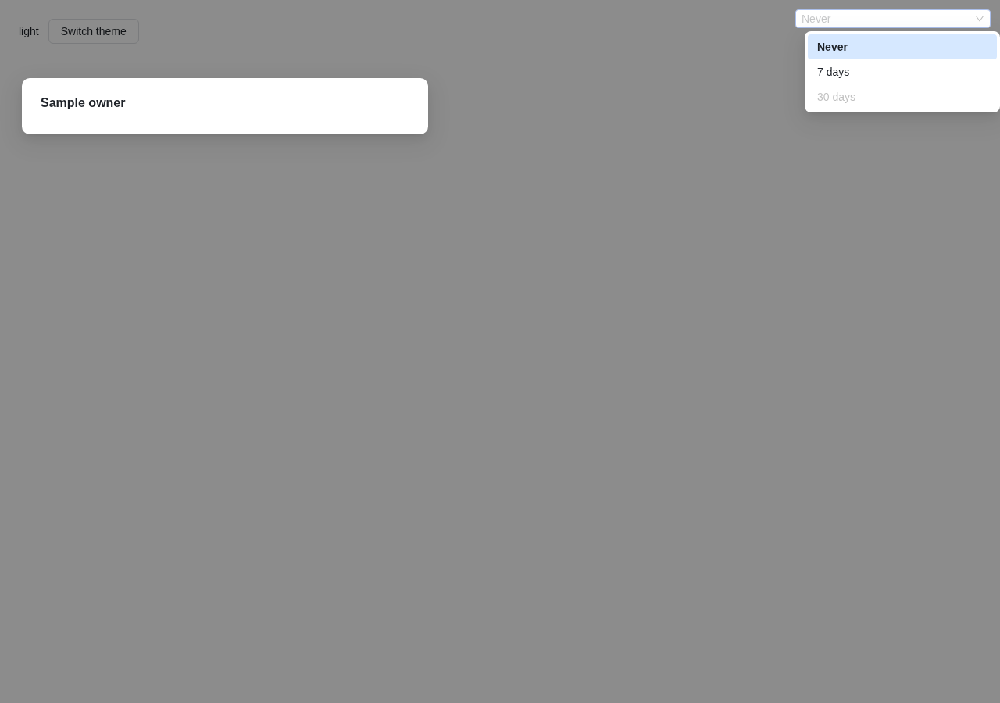
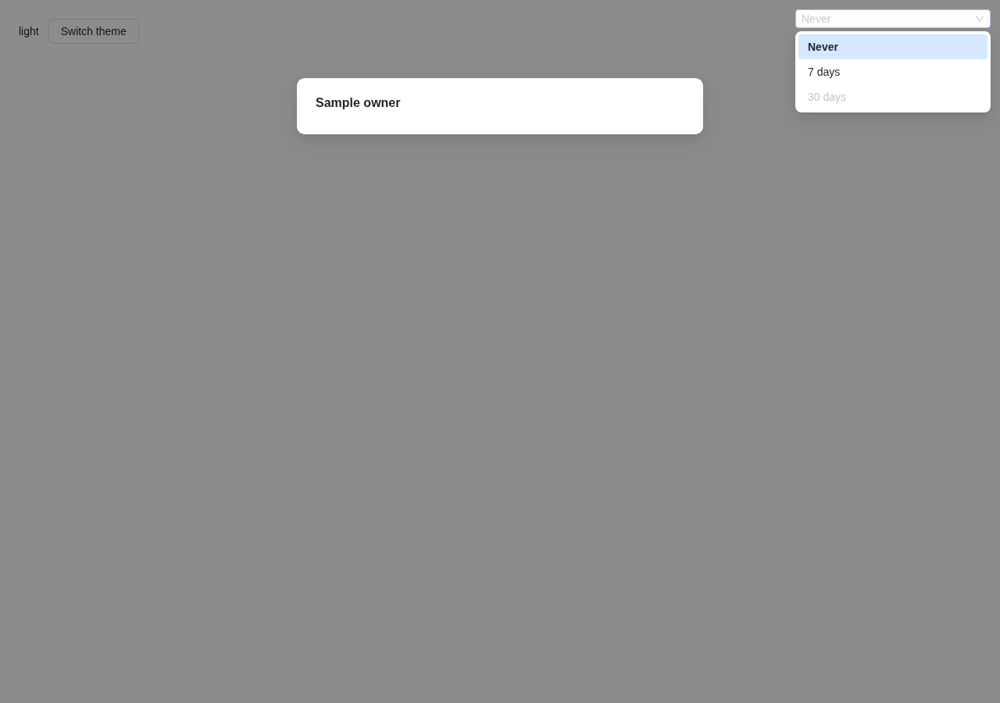

# 浮层第一帧位置：已定位容器内 Select/Combobox/MultiSelect/Menu/Popover/Tooltip

任务 [浮层第一帧位置](orbit-task:34broktJh4EJXI1eiF7Jm)，属于 [Orbit Web 组件迁移](orbit-project:34ZZeq0e3IR65GVm2kAs7)，服务于验收项 P2（弹层、选择及反馈组件保持现有键盘、焦点、通知和确认行为）。起因是 [P4.1](orbit-task:34Za39Do3N6tkmIMP0GBP) 的发现（[p4.1/README](../p4.1/README.md)「报告协调者的问题」第 2 条）。

## 结论

- **根因**（Base UI 1.8.0）：浮层定位前按 `position: fixed` 测量、再按 `absolute` 套用第一次结果。挂进弹层（Dialog、Drawer、ConfirmDialog、Popover 内容、旧 Modal 里的 OverlayScope）的浮层以弹层盒为定位参照，第一次结果偏一个弹层原点（1280×900 对话框里 (+380, +100)），到下一次测量才回位。
- **修法**：`useFloating` 统一给出 `positionMethod`——挂进弹层的用 `fixed`，挂在 body 的保持 `absolute`；Menu（含子菜单）、Select、Combobox、MultiSelect、Popover、Tooltip、Popconfirm 的 Positioner 都传它。稳定位置相对锚点不变，只有 Linux WebKit 手机模拟里页面上的 Popconfirm 从 382 宽回到 390（与旧组件、P3.2 验收时相同，见[修法](#修法)）。
- **第一帧**：常驻用例 `choices-first-frame.browser.mjs` 在 12 处（页面、对话框、抽屉；翻到上方、贴右缘、滚动、带 transform）逐帧读 rAF 回调里和帧产出之后的位置。修复树八个环境 128/128（最终轮，在全量 choices 里）：每一次读到的位置从第一帧起就是稳定位置，打开不滚动拥有者，默认动效下 Positioner 不动；同提交参照 112 个失败、16 个通过，失败都在对话框、抽屉各处（Popconfirm 两树都通过，P4.1 已改）。
- **错位的影响**：Chromium begin-frame 逐帧出图证明，修复前绘制出来的帧里浮层已经在正确位置；错位在每帧 rAF 回调读到的布局里。Base UI 在 rAF 里移动焦点、滚入高亮项，错位的浮层在视口外时就把对话框视口滚过去：对话框右缘（桌面）横向跳 352px（Chromium 半秒滑回，WebKit 停在 336px），已滚动的对话框纵向跳。修复后不再发生：rAF 回调里读到的位置与稳定位置一致，绘制出来的帧也一致（begin-frame 第 0 帧画面一致 1.0，见[机制](#错位在哪一刻raf-读到绘制帧里没有)）。
- **与旧 AntD**：修复树上比较的 448 处稳定框与同一处的旧组件都在半像素以内；旧组件自己的第一帧在 448 处里都已在稳定位置（淡入），所以修复后与旧组件的第一帧位置相同。Linux WebKit 手机模拟视觉视口收窄的 64 处只记录、不比较（其中 60 处两边本来就相同）。
- **回归**（最终轮，`origin/main` `404c5ffce` 上；之后跟上 `4181a90ec`，main 新增的提交没有改 Web 的任何输入）：项目合并检查在会话工作树（NVMe）上通过，370 个文件、4785 个用例（第二轮在 HDD 上 `ProjectTasksGraph.test.tsx` 一个用例 33.3 秒超时，见[回归](#回归)）；全量 choices 648/648；overlays 96/96；P0 两树都是 101 通过、11 跳过、0 失败；试点两树 80/80；P4.1 页面两树 96/96；第 2 批窗口冻结帧 392/392、`4fb7ee43f` 原探针 80/80；`632b7950e` 原探针 1104/1104（第一轮，所测源码未变）；Menu 的 Tab 约定三处依据都通过。试点对照里确定的差异只有 Chromium 手机分享对话框三张截图的阴影或抗锯齿边缘（每通道 ≤3/255，一张 27 像素 ≤6/255），计算样式与请求都相同；P4.1 页面参照与修复之间没有超出抗锯齿级的截图。
- **清单**：本分支没有带来未归属点。交付的提交上 `--check-owners` 在本分支与单独的 `origin/main`（`4181a90ec`）上都是 0 个未归属、0 个待定；前两轮那 14 个点都随 main 来（与单独在当时的 `origin/main` 上跑相同），协调者已判定，P4.2 的 `2026-10-07c.json` 已登记。新增的 antd `Drawer` 参照导入登记为 `inventory-delta/2026-10-08.json`（最终轮按新基础重新生成，核对全部通过）。
- **范围外**：子菜单的稳定几何与旧组件不同（x 多 4px、宽度等于触发项），修复前后相同；子菜单稳定几何差异另由协调者任务处理。

## 机制（Base UI 1.8.0）

`internals/useAnchorPositioning.mjs`：

- 浮层还没定位时（`isPositioned` 为假），Positioner 的样式是 `position: fixed; top: 0; left: 0; opacity: 0`（注释：防止 autoFocus 滚动跳动）。
- 第一次 `computePosition` 就在这时测量。浮层是 fixed，Floating UI 取它的 offsetParent 时按 fixed 的规则找包含块：没有带 transform/filter 的祖先时就是视口，算出页面坐标。
- 结果按 `positionMethod`（默认 `absolute`）套用，`isPositioned` 变真，浮层变为不透明。
- 挂在 body 的浮层，absolute 的参照就是页面，第一次结果正确。
- 挂进弹层的浮层（Dialog/Drawer/ConfirmDialog 的 portal 宿主在弹层盒里，Popover 内容、旧 Modal 里的 `OverlayScope` 同理），absolute 的参照是弹层盒（`.orbit-overlay` 为 `position: relative`，`.orbit-drawer` 为 `absolute`），第一次结果多出一个弹层原点：1280×900 的对话框里是 (+380, +100)，手机上是 (+8, +108)，抽屉里是 (+902, 0)。
- 第二次测量（autoUpdate 的 ResizeObserver 首次回调）按 absolute 的真实 offsetParent 计算，位置回到正确处。

### 错位在哪一刻：rAF 读到，绘制帧里没有

用 Chromium headless shell 的 begin-frame 控制逐帧出图（[painted.mjs](painted.mjs)）：打开输入之后，每一帧都由脚本要求浏览器产出，并带回该帧的截图。

[probes/](probes) 里是两棵树各一份记录（`ref-desktop.json` 等）和下面两张整帧截图；探针由 [probes.sh](probes.sh) 在网络命名空间里对两棵树各起一个开发服务器运行。表中坐标是浮层表面左上角，「画面一致」是第 0 帧截图里稳定框区域与最后一帧相同像素的比例：

| 情形（减少动态效果） | 树 | 第 0 帧 rAF 里读到 | 第 0 帧产出后 | 第 0 帧画面一致 |
| --- | --- | --- | --- | --- |
| 桌面，对话框里的 MultiSelect | 参照 | (784, 360) | (404, 260) | 1.0 |
| | 修复 | (404, 260) | (404, 260) | 1.0 |
| 桌面，对话框里键盘打开的 Menu | 参照 | (784, 368) | (404, 268) | 1.0 |
| | 修复 | (404, 268) | (404, 268) | 1.0 |
| 手机，对话框里的 MultiSelect | 参照 | (40, 376) | (32, 268) | 1.0 |
| | 修复 | (32, 268) | (32, 268) | 1.0 |
| 手机，对话框里的 Menu | 参照 | (40, 384) | (32, 276) | 1.0 |
| | 修复 | (32, 276) | (32, 276) | 1.0 |
| 页面上的 MultiSelect、Menu | 两树 | 稳定位置 | 稳定位置 | 1.0 |

对话框右缘的 Select（桌面）第 0 帧两棵树都还没显示浮层（Base UI 从第 1 帧起显示 Positioner），第 1 帧起：

| 帧 | 参照：rAF 里读到 | 参照：对话框盒 x / 视口 scrollLeft | 修复：rAF 里读到 | 修复：对话框盒 x / scrollLeft |
| --- | --- | --- | --- | --- |
| 1 | (1398, 140) | 28 / 352 | (1018, 40) | 380 / 0 |
| 2 | (1030, 40) | 52 / 328 | (1018, 40) | 380 / 0 |
| 3 | (1030, 40) | 64 / 316 | (1018, 40) | 380 / 0 |
| 7 | (1030, 40) | 112 / 268 | (1018, 40) | 380 / 0 |

| 参照第 1 帧（对话框被横向滚到左侧，列表比触发器右缘多出 12px） | 修复第 1 帧 |
| --- | --- |
|  |  |

拥有者滚动的逐事件记录（[scroll-jump.mjs](scroll-jump.mjs)，[probes/scroll-jump-*.json](probes)，打开后 900ms 内弹层视口的每个 scroll 事件）：

| 环境 | 情形 | 参照 | 修复 |
| --- | --- | --- | --- |
| Chromium 桌面 | 对话框右缘 Select / MultiSelect / 键盘 Menu | 30 / 20 / 27 个事件，最大 352 / 352 / 350px，Select 与 Menu 约 0.5 秒回到 0 | 0 |
| WebKit 桌面 | 同上 | 各 1 个事件，滚到 336 / 336 / 334px 后停住 | 0 |
| 桌面两种浏览器 | 抽屉里的 Select | 1 个事件，没有净位移 | 0 |
| 手机两种浏览器 | 以上各处 | 0（手机上对话框原点只差 (+8, +108)，错位的列表还在视口内） | 0 |
| 各环境 | 对话框里（不贴边）的 Select、Menu | 0 | 0 |

探针各处除参照树对话框右缘那几处（读数时对话框还在回滑，列表在 x 1030；滑回 0 之后同为 1018）外，两棵树的稳定框都相同。

浏览器一帧的顺序是 requestAnimationFrame 回调 → 样式与布局 → ResizeObserver 回调（这里触发第二次测量，同一帧内重新布局）→ 绘制。所以：

- 修复前，绘制出来的帧里浮层已经在正确位置（上表「第 0 帧画面一致」都是 1.0）；P4.1 在 rAF 回调里采样，读到的是第二次测量之前的布局。
- 但同一帧 rAF 回调里做的事都读到错位的布局。Base UI 打开 Select、用键盘打开菜单时把焦点移进列表或菜单项，Combobox、MultiSelect 把高亮项滚入视野，都在 rAF 里：错位的浮层在弹层视口之外时，浏览器就滚动弹层视口去露出它。对话框右缘（桌面）是横向：Chromium 里对话框盒从 x 380 跳到 28，之后每帧回退约 12px、半秒左右回到原处；WebKit 里停在 336px 不回来。已滚动的对话框里是纵向（八个环境，见下节）。修复后哪里都不滚。
- 绘制帧的直接证据只有 Chromium；WebKit 没有 begin-frame 控制，用 rAF 回调里和帧产出之后两次读取，修复前后的结论相同。

## 修法

`components/ui/Floating.ts` 的 `useFloating`（所有 Orbit 浮层共用）返回 `positionMethod`，各浮层的 Positioner 传给 Base UI：

- 挂进弹层的（`useOverlayChild` 能取到 OverlayScope）用 `fixed`：第一次测量与套用是同一种方式，从第一次起就在页面坐标里，与旧组件挂在 body 上时一样；也不被弹层盒的宽度限制（P4.1 发现的 Popconfirm 手机宽度 374 对 390 的同类问题）。滚动由 Floating UI 的 autoUpdate 跟随弹层视口的 scroll，与旧 rc-trigger 在弹层里跟随滚动的方式相同。
- 挂在 body 的保持 `absolute`：这里 absolute 本来就是页面坐标，第一次测量就对；它随页面滚动原生移动，与旧组件（同样是 body 里的 absolute）相同。改成 fixed 反而要靠脚本跟随页面滚动，WebKit 手机模拟里溢出后排版的 fixed 元素还会按 382px 宽排（[p4.1](../p4.1/README.md)「WebKit 手机的固定定位宽度」）。
- `Overlay.tsx` 的 `useOverlayChild` 多返回一个 `inOverlay`。Menu（含子菜单）、Select、Combobox、MultiSelect、Popover、Tooltip 的 Positioner 传 `positionMethod={layer.positionMethod}`。
- Popconfirm 原来（P4.1）在所有位置都是 `fixed`，现在走同一条规则：对话框里仍是 fixed；页面上回到 P3.2 验收时的 absolute。Linux WebKit 手机模拟里页面溢出后，fixed 的 Popconfirm 按收窄的 382px 排（旧确认浮层 390），absolute 的与旧组件同为 390（见[与旧 AntD 对照](#与旧-antd-对照)）；Chromium 与桌面上两种写法放在同一处，试点与 P4.1 页面的对照也不变（见[回归](#回归)）。
- 稳定位置：最终轮常驻用例的 864 处里，稳定框相对锚点有 844 处两树相同。不同的 20 处：参照树对话框右缘的 Select、Combobox、MultiSelect 和键盘打开的 Menu（Chromium 桌面两个环境共 8 处，读数时对话框还在回滑，列表比锚点对齐处偏右 12–13px；修复树与旧组件相同）；Linux WebKit 手机模拟两个环境页面上的 Popconfirm（12 处，参照树 fixed 按收窄的视觉视口排成 382 宽，修复树 absolute 390 宽，与旧组件相同，见上条）。参照树「dialog, scrolled」各处打开时滚动了对话框视口（锚点随之移动 118–124px），稳定框在视口里的位置因此与修复树不同，相对锚点仍相同。

提交（交证据前最后 rebase 到 `origin/main` `4181a90ec`；括号里依次是最终轮、第二轮和第一轮的号，各轮运行记录里出现的是它们）：

| 提交 | 内容 |
| --- | --- |
| `f24f01f88`（`8fa531c43`、`607487faa`、`4162d3f4e`） | test：`choices-first-frame.browser.mjs`；choices fixture 的样例加 `owner=dialog\|drawer`、`scroll`、`transform`，Popconfirm 样例加 `.sample-surface` |
| `2a3794dcc`（`cd9301353`、`55deba29e`、`6e12cab6d`） | fix：`Floating.ts`、`Overlay.tsx`、`Menu.tsx`、`Select.tsx`、`Combobox.tsx`、`MultiSelect.tsx`、`Popover.tsx`、`Tooltip.tsx`、`Popconfirm.tsx`；`components/ui/README.md` 补「浮层都放在页面坐标里」一段。**同提交参照就是只反向打回这一个提交** |
| `cfb7255a5`（`12d31aef7`、`1bad302d9`、`c3a2abab1`） | test：加 `page, scrolled`（fixture `pagescroll`）；视觉视口收窄的页面只记录、不与旧组件比较 |
| `a663d19ca`（`23b0e5264`、`3a1eadcf8`、`a758c04f4`） | test：有前置步骤的样例（子菜单先开父菜单）也先等样例静止 |
| `23bdf0064`（`25d2989a9`、`c4c94c924`、`197e5909b` + `c7ddf671d`） | docs：`inventory-delta/2026-10-08.json` 与生成、核对脚本（见[清单复扫](#清单复扫)）；每次 rebase 后按新的提交号重新生成 |
| `31b737924`（`aa162207c`、`3cc94ade1`） | test：稳定后读旧组件时它没有显示（旧子菜单靠指针进入触发项打开，偶尔没打开），就再打开采一次，并在报告里留注记（`replaced popup sampled again`）；两次都没显示仍然失败 |

## 常驻用例：`choices-first-frame.browser.mjs`

在 `npm run test:ui-choices` 里（八环境），每种浮层两个用例：

- **减少动态效果**：在每一处打开浮层，从打开输入起每帧读两次浮层表面的框：rAF 回调里（ResizeObserver 之前）和该帧产出之后（MessageChannel，帧已绘制）。断言：
  1. 每一次「已显示」的读取（有尺寸、不透明度大于 0），第一帧的两次都算，等于稳定后的框（出现 12 帧且动画结束后再读一次）；
  2. 打开不滚动拥有者（锚点的各级滚动容器和页面的 scrollLeft/scrollTop 全程不变）；
  3. 有旧组件对照的位置：Orbit 稳定框相对锚点的位置与尺寸，与同一处旧 AntD 浮层相差都在半像素以内。旧组件不逐帧观察，只在稳定后读一次：rc-trigger 在缩放动画进行中按缩放后的框对齐（减少动态效果下旧组件也有动画），页面每帧强制布局会让它的对齐差 1px（不观察时同一处多次打开结果相同，见[与旧 AntD 对照](#与旧-antd-对照)）。
     - 例外：Linux WebKit 的手机模拟在页面溢出后把视觉视口按经典滚动条收窄（382 对 390px，[p4.1](../p4.1/README.md)「WebKit 手机的固定定位宽度」）。这时 Floating UI 把浮层限在视觉视口内、rc-trigger 限在布局视口内，溢出之后才排版的固定定位样例区也按 382 排，两页不在同一个视口里。任一页的 `visualViewport.width` 不等于 `clientWidth` 时，这一处只记录两边的框、不比较，并在报告里留注记（`not compared with AntD`）。真机 iOS 的滚动条是覆盖式的，没有这种收窄。
- **默认动效**：同样逐帧采样，断言 Positioner 从 Base UI 显示它的那一帧起位置不变（表面在里面缩放、淡入）。

| 种类 | 样例 | 打开方式 |
| --- | --- | --- |
| Menu | `attachment`（附件菜单） | 指针，以及键盘 ↓（键盘打开时没有指针打开那次额外渲染，修复前错位只在键盘打开时出现） |
| 子菜单 | `submenu`（Provider ▸ Codex/Claude） | 先打开父菜单，再把指针分步移到 Provider 上 |
| Select | `expiry` | 指针 |
| Combobox | `search` | 指针 |
| MultiSelect | `multiple` | 指针 |
| Popover | `popover` | 指针 |
| Tooltip | `tooltip` | 悬停 |
| Popconfirm | `popconfirm` | 指针（回归：P4.1 已改） |

手机项目上指针是触摸（tap）。各处（括号内为是否与旧组件对照、是否也跑默认动效）：

| 位置 | 做法 | 旧组件 | 默认动效 |
| --- | --- | --- | --- |
| page | 页面直接挂载 | ✓ | ✓ |
| page, flipped above | 锚点贴视口底边（`anchor=bottom`），翻到上方 | ✓ | |
| page, right edge | 锚点贴视口右边（`anchor=right`），对齐翻转或滑回视口 | ✓ | |
| page, scrolled | 页面本身前后各一屏内容，滚到样例（`pagescroll`；挂在 body 的浮层第一次测量要加上页面滚动） | ✓ | |
| page, scrolled box | 样例在可滚动盒里，前后各一屏内容，滚到中间（`scroll`） | | |
| page, moved box | 样例外层 `transform: translate(16px, 8px)` | | |
| dialog | Orbit Dialog / 旧 Modal 里（`owner=dialog`） | ✓ | ✓ |
| dialog, flipped above | 对话框里，锚点贴视口底边 | ✓ | ✓ |
| dialog, right edge | 对话框里，锚点贴视口右边 | ✓ | |
| dialog, scrolled | 对话框内容前后各一屏，滚动对话框视口到样例 | | |
| dialog, moved | 对话框本身 `transform: translate(16px, 8px)`（fixed 浮层的包含块变成对话框） | | |
| drawer | Orbit Drawer / 旧 Drawer 里（`owner=drawer`） | ✓ | ✓ |

子菜单与旧组件只比纵向位置：Orbit 子菜单从父菜单外缘起（x 多 4px）、最小宽度等于触发项，旧子菜单压住父菜单内边距、宽度按内容。这是本任务之前就有的差异，**子菜单稳定几何差异另由协调者任务处理**。

## 修复前后（同提交参照）

运行分三轮，都按作业指导「跟上 main」：

- **第一轮**（开工后 main 前进了 45 个提交，项目 tip 不在 main 里）：项目 tip `1d3cd4c70` merge `origin/main` `def134095` 得到 `3350a7074`，两棵树在它之上。逐帧探针、拥有者滚动、旧组件第一帧探针、Select 的 `632b7950e` 原探针，以及试点与 P4.1 页面的两轮对照（含同一棵树的噪声对照）都在这一轮。
- **第二轮**（main 又前进了 83 个提交，项目 tip 已包含在 main 里）：rebase 到 `origin/main` `6a58a9515`，两棵树在 `c4c94c924`，重跑了合并检查、P0、choices、overlays、试点与 P4.1 页面、冻结帧与 `4fb7ee43f` 原探针。结果列在[回归](#回归)表的最后一列；合并检查在 HDD 上超时（见表下）。
- **最终轮**（P4.2 的项目 tip `44a569d8b` 合进 main，其中 `822c00ff0` 修好了 P4.1 设置页用例的 strict mode 失败，并改了 `components/ui` 的共享组件：NumberInput、Result、Descriptions、TableFrame、Badge、Button、RadioGroup、PasswordInput、ConfirmDialog、Switch）：rebase 到 `origin/main` `404c5ffce`，没有冲突，两棵树在 `aa162207c`。按协调者要求重跑合并检查（会话工作树，NVMe）、P0 两树、overlays、全量 choices、本任务用例的参照树、试点与 P4.1 页面两树、冻结帧、`4fb7ee43f` 原探针。

- **最后跟上 main**（证据写完时 main 又前进了 8 个提交，到 `4181a90ec`，只改了 Android 客户端、apiserver 的 wiki 与文档）：rebase 到 `origin/main` `4181a90ec`，没有冲突。`src/web`、`src/shared`、`package.json`、`package-lock.json` 与最终轮运行的 `aa162207c` 逐字节相同（`git diff --quiet aa162207c 31b737924 -- src/web src/shared package.json package-lock.json`），所以浏览器与合并检查没有重跑，最终轮的结果代表交付的提交；`2026-10-08.json` 按新的提交号重新生成，清单核对在新的提交上重跑（见[清单复扫](#清单复扫)）。

**沿用的探针**：逐帧出图、拥有者滚动、旧组件第一帧三项探针和 Select 的 `632b7950e` 原探针是第一轮（`c7ddf671d`）的结果，没有重跑。它们所测的浮层定位源码——`Floating.ts`、`Floating.css`、`Overlay.tsx`、`Menu.tsx`、`Select.tsx`、`Select.css`、`Combobox.tsx`、`MultiSelect.tsx`、`Popover.tsx`、`Tooltip.tsx`、`Popconfirm.tsx`、`Dialog.tsx`、`Drawer.tsx`、choices fixture，以及 `package.json`/`package-lock.json`——从 `c7ddf671d` 到 `aa162207c` 只有两处变化（`git diff --stat c7ddf671d aa162207c`）：`Overlay.css` 加了一行 `.orbit-confirm-icon-success` 的颜色（P4.2 的成功确认框），fixture 多了只在 `pagescroll` 参数下生效的页面滚动样例（本任务 `cfb7255a5`）。`components/ui` 里 P4.2 的其他改动（新组件 NumberInput、Result、Descriptions、TableFrame，Button 的 `dashed`、RadioGroup 的 `buttonStyle="solid"`、ConfirmDialog 的 `kind="success"`、Badge 的新色调、Switch 的最小宽度，foundation.css 新增的颜色变量）都只在新属性、新组件或开关上生效，探针所用的样例没有用到。fixture 入口还引入全局 `index.css`：main 在这期间改了它 383 行，规则都挂在 P4.x 页面自己的类名下（`rd-*`、`re-*`、`pool-*`、`wk-*`、对话框各自的类等），fixture 用到的类名在这段 diff 里一个也没有。

每轮的两棵树都是 `/mnt/data/tmp/overlay-first-frame-34brok/` 下的独立检出（[sync.sh](sync.sh)）：

- 修复树 `run`：当轮分支的 `src/web`；
- 同提交参照 `ref`：同一份源码把修复提交（最终轮 `cd9301353`，第二轮 `55deba29e`，第一轮 `6e12cab6d`）反向打回，10 个文件，测试与 fixture 不动。

每次运行都在自己的网络命名空间里（只有 lo，固定端口不会撞上别的会话），`nice -n -10`，一次只跑一个（[queue.sh](queue.sh)），原始结果留在上面的目录，这里是 [collect.sh](collect.sh) 的瘦身副本（[runs/](runs)，最终轮的目录名以 `fix-404c-` 或 `ref-404c-` 开头）。合并检查按协调者要求不在 /mnt/data（HDD）上跑，而在本会话的工作树（根盘 NVMe）上跑（[merge-check-nvme.sh](merge-check-nvme.sh)，命令与包装同队列），跑完删掉依赖叠加。

**参照树 [ref-404c-firstframe](runs/ref-404c-firstframe)（只撤回修复）**

每格：第一帧不在稳定框的位置数 / 打开时拥有者滚动的位置数 / 默认动效下 Positioner 移动的位置数

| 种类 | chromium-light-desktop | chromium-light-phone | chromium-dark-desktop | chromium-dark-phone | webkit-light-desktop | webkit-light-phone | webkit-dark-desktop | webkit-dark-phone |
| --- | --- | --- | --- | --- | --- | --- | --- | --- |
| menu | 5/2/3 | 5/1/3 | 5/2/3 | 5/1/3 | 5/2/4 | 5/1/4 | 5/2/3 | 5/1/3 |
| submenu | 5/0/3 | 5/0/3 | 5/0/3 | 5/0/3 | 5/0/3 | 5/0/3 | 5/0/3 | 5/0/3 |
| select | 5/2/3 | 5/1/3 | 5/2/3 | 5/1/3 | 5/2/3 | 5/1/3 | 5/2/3 | 5/1/3 |
| combobox | 4/2/2 | 4/1/2 | 4/2/2 | 4/1/2 | 4/2/2 | 4/1/2 | 4/2/2 | 4/1/2 |
| multiselect | 4/2/2 | 4/1/2 | 4/2/2 | 4/1/2 | 4/2/2 | 4/1/2 | 4/2/2 | 4/1/2 |
| popover | 5/0/3 | 5/0/3 | 5/0/3 | 5/0/3 | 5/0/3 | 5/0/3 | 5/0/3 | 5/0/3 |
| tooltip | 5/0/3 | 5/0/3 | 5/0/3 | 5/0/3 | 5/0/3 | 5/0/3 | 5/0/3 | 5/0/3 |
| popconfirm | 0/0/0 | 0/0/0 | 0/0/0 | 0/0/0 | 0/0/0 | 0/0/0 | 0/0/0 | 0/0/0 |

**修复树 [fix-404c-choices](runs/fix-404c-choices)（全量 choices 里的本任务用例）**

| 种类 | chromium-light-desktop | chromium-light-phone | chromium-dark-desktop | chromium-dark-phone | webkit-light-desktop | webkit-light-phone | webkit-dark-desktop | webkit-dark-phone |
| --- | --- | --- | --- | --- | --- | --- | --- | --- |
| menu | 0/0/0 | 0/0/0 | 0/0/0 | 0/0/0 | 0/0/0 | 0/0/0 | 0/0/0 | 0/0/0 |
| submenu | 0/0/0 | 0/0/0 | 0/0/0 | 0/0/0 | 0/0/0 | 0/0/0 | 0/0/0 | 0/0/0 |
| select | 0/0/0 | 0/0/0 | 0/0/0 | 0/0/0 | 0/0/0 | 0/0/0 | 0/0/0 | 0/0/0 |
| combobox | 0/0/0 | 0/0/0 | 0/0/0 | 0/0/0 | 0/0/0 | 0/0/0 | 0/0/0 | 0/0/0 |
| multiselect | 0/0/0 | 0/0/0 | 0/0/0 | 0/0/0 | 0/0/0 | 0/0/0 | 0/0/0 | 0/0/0 |
| popover | 0/0/0 | 0/0/0 | 0/0/0 | 0/0/0 | 0/0/0 | 0/0/0 | 0/0/0 | 0/0/0 |
| tooltip | 0/0/0 | 0/0/0 | 0/0/0 | 0/0/0 | 0/0/0 | 0/0/0 | 0/0/0 | 0/0/0 |
| popconfirm | 0/0/0 | 0/0/0 | 0/0/0 | 0/0/0 | 0/0/0 | 0/0/0 | 0/0/0 | 0/0/0 |

**参照树上第一帧不在稳定框的位置（八个环境相同）**

- menu：每个环境都有 ['dialog (keyboard)', 'dialog, flipped above (keyboard)', 'dialog, right edge (keyboard)', 'dialog, scrolled (keyboard)', 'drawer (keyboard)']
- submenu：每个环境都有 ['dialog (pointer)', 'dialog, flipped above (pointer)', 'dialog, right edge (pointer)', 'dialog, scrolled (pointer)', 'drawer (pointer)']
- select：每个环境都有 ['dialog (pointer)', 'dialog, flipped above (pointer)', 'dialog, right edge (pointer)', 'dialog, scrolled (pointer)', 'drawer (pointer)']
- combobox：每个环境都有 ['dialog (pointer)', 'dialog, right edge (pointer)', 'dialog, scrolled (pointer)', 'drawer (pointer)']
- multiselect：每个环境都有 ['dialog (pointer)', 'dialog, right edge (pointer)', 'dialog, scrolled (pointer)', 'drawer (pointer)']
- popover：每个环境都有 ['dialog (pointer)', 'dialog, flipped above (pointer)', 'dialog, right edge (pointer)', 'dialog, scrolled (pointer)', 'drawer (pointer)']
- tooltip：每个环境都有 ['dialog (pointer)', 'dialog, flipped above (pointer)', 'dialog, right edge (pointer)', 'dialog, scrolled (pointer)', 'drawer (pointer)']
- popconfirm：每个环境都有 无

参照树上：

- 失败都在弹层里（dialog、drawer 各处）；页面上各处、`dialog, moved` 两棵树都通过：对话框带 transform 时它就是 fixed 浮层的包含块，第一次测量已经按它算。
- Menu 只有键盘打开时失败；指针打开那次多一轮渲染，第一个 rAF 之前已经重新测量过。
- Popconfirm 两棵树都通过：P4.1 已把它改成 fixed。
- 「拥有者滚动」出现在对话框右缘（桌面四个环境，横向）和已滚动的对话框里（八个环境，纵向），都是 Select、Combobox、MultiSelect 和键盘打开的 Menu：Base UI 在 rAF 里把焦点移进列表或菜单项（Select、Menu），或把高亮项滚入视野（Combobox、MultiSelect 的焦点留在输入框），错位的浮层在弹层视口之外，视口就跟着滚过去。

## 与旧 AntD 对照

**旧组件自己的第一帧**（[antd-first-frame.browser.mjs](antd-first-frame.browser.mjs) + [antd-first-frame.config.mjs](antd-first-frame.config.mjs)，八环境，减少动态效果，[runs/fix-antd-first-2](runs/fix-antd-first-2)）：同样的 7 处、8 种浮层，从打开输入起逐帧读旧组件浮层根元素的 `left`/`top`（rc-trigger 用它定位，动画只加在 transform 上）。**64/64**：448 处里旧组件第一次显示的那一帧就已经在稳定位置，那一帧的不透明度在 0.043–1 之间（淡入）。这与 P4.1 的观察（「旧 AntD 下拉第一帧就在最终位置，只是淡入」）一致，所以「第一帧在稳定位置」与「和同一处旧组件的位置相同」放在一起，就是修复后与旧组件相同的第一帧。（第一次跑这个探针时没等旧 Modal 的放大动画结束就打开，3 处读到 Modal 还在动时的位置，改成与常驻用例相同的「样例静止后再打开」后重跑。）

**稳定位置与旧组件对照**（常驻用例的第 3 条断言，最终轮：修复树 [fix-404c-choices](runs/fix-404c-choices)，参照树 [ref-404c-firstframe](runs/ref-404c-firstframe)，逐处汇总在 [first-frames.json](first-frames.json)）：

- 参照树（ref-404c-firstframe）：442 处在半像素以内；不符 6 处；不比较 64 处（其中两边的框本来就在半像素以内的 54 处）
  - 不符：chromium-light-desktop select dialog, right edge (pointer)：Orbit [1030, 40, 250, 104]，AntD [1018, 40, 250, 104]
  - 不符：chromium-light-desktop combobox dialog, right edge (pointer)：Orbit [1030, 48, 250, 104]，AntD [1018, 48, 250, 104]
  - 不符：chromium-light-desktop multiselect dialog, right edge (pointer)：Orbit [1030, 40, 250, 136]，AntD [1018, 40, 250, 136]
  - 不符：chromium-dark-desktop select dialog, right edge (pointer)：Orbit [1030, 40, 250, 104]，AntD [1018, 40, 250, 104]
  - 不符：chromium-dark-desktop combobox dialog, right edge (pointer)：Orbit [1030, 48, 250, 104]，AntD [1018, 48, 250, 104]
  - 不符：chromium-dark-desktop multiselect dialog, right edge (pointer)：Orbit [1030, 40, 250, 136]，AntD [1018, 40, 250, 136]
  - 不比较且不同：webkit-light-phone tooltip page, right edge (pointer)（视觉/布局视口 Orbit [382, 390]，AntD [382, 390]）：Orbit [207, 56, 166.969, 34]，AntD [211.031, 56, 166.969, 34]
  - 不比较且不同：webkit-light-phone popconfirm page (pointer)（视觉/布局视口 Orbit [382, 390]，AntD [382, 390]）：Orbit [0, 24, 382, 126]，AntD [0, 24, 390, 126]
  - 不比较且不同：webkit-light-phone popconfirm page, flipped above (pointer)（视觉/布局视口 Orbit [382, 390]，AntD [382, 390]）：Orbit [0, 662, 382, 126]，AntD [0, 662, 390, 126]
  - 不比较且不同：webkit-light-phone popconfirm page, right edge (pointer)（视觉/布局视口 Orbit [382, 390]，AntD [382, 390]）：Orbit [0, 57, 382, 126]，AntD [0, 57, 390, 126]
  - 不比较且不同：webkit-light-phone popconfirm page, scrolled (pointer)（视觉/布局视口 Orbit [382, 390]，AntD [382, 390]）：Orbit [0, 268, 382, 126]，AntD [0, 268, 390, 126]
  - 不比较且不同：webkit-dark-phone tooltip page, right edge (pointer)（视觉/布局视口 Orbit [382, 390]，AntD [382, 390]）：Orbit [207, 56, 166.969, 34]，AntD [211.031, 56, 166.969, 34]
  - 不比较且不同：webkit-dark-phone popconfirm page (pointer)（视觉/布局视口 Orbit [382, 390]，AntD [382, 390]）：Orbit [0, 24, 382, 126]，AntD [0, 24, 390, 126]
  - 不比较且不同：webkit-dark-phone popconfirm page, flipped above (pointer)（视觉/布局视口 Orbit [382, 390]，AntD [382, 390]）：Orbit [0, 662, 382, 126]，AntD [0, 662, 390, 126]
  - 不比较且不同：webkit-dark-phone popconfirm page, right edge (pointer)（视觉/布局视口 Orbit [382, 390]，AntD [382, 390]）：Orbit [0, 57, 382, 126]，AntD [0, 57, 390, 126]
  - 不比较且不同：webkit-dark-phone popconfirm page, scrolled (pointer)（视觉/布局视口 Orbit [382, 390]，AntD [382, 390]）：Orbit [0, 268, 382, 126]，AntD [0, 268, 390, 126]
- 修复树（fix-404c-choices）：448 处在半像素以内；不符 0 处；不比较 64 处（其中两边的框本来就在半像素以内的 60 处）
  - 不比较且不同：webkit-light-phone tooltip page, right edge (pointer)（视觉/布局视口 Orbit [382, 390]，AntD [382, 390]）：Orbit [207, 56, 166.969, 34]，AntD [211.031, 56, 166.969, 34]
  - 不比较且不同：webkit-light-phone popconfirm page, right edge (pointer)（视觉/布局视口 Orbit [382, 390]，AntD [382, 390]）：Orbit [0, 57, 390, 126]，AntD [0, 57, 390, 126]
  - 不比较且不同：webkit-dark-phone tooltip page, right edge (pointer)（视觉/布局视口 Orbit [382, 390]，AntD [382, 390]）：Orbit [207, 56, 166.969, 34]，AntD [211.031, 56, 166.969, 34]
  - 不比较且不同：webkit-dark-phone popconfirm page, right edge (pointer)（视觉/布局视口 Orbit [382, 390]，AntD [382, 390]）：Orbit [0, 57, 390, 126]，AntD [0, 57, 390, 126]

- 修复树上，比较了的每一处都与旧组件在半像素以内；Tooltip 在右缘时旧组件保留了 0.031px 的小数余数（rc-trigger 以右缘定位、宽度带小数），Orbit 按整像素向下取整，相差在半像素内。
- 没有比较的都是 WebKit 手机页面上的各处（页面溢出、视觉视口 382 / 布局视口 390）。这些地方两边的框照样记录：大部分本来就相同；不同的两类——
  - 右缘的 Tooltip：Floating UI 按 382 的视觉视口避让，比旧组件（按 390）往左 4px。修复前后相同，本任务没有改这条路径。
  - 右缘的 Popconfirm：两边的确认浮层都是 `[0, 57, 390, 126]`，只是 fixture 的固定定位样例区在 Orbit 页里按 382 排、触发器左移了 8px，相对锚点的比较才不同。
- 参照树上另有两类不同：对话框右缘的 Select、Combobox、MultiSelect（读数时对话框还在回滑，列表在 x 1030，旧组件 1018）；WebKit 手机页面上 P4.1 那种处处 fixed 的 Popconfirm 宽 382（旧组件 390）。修复后都没有了。
- 旧组件不逐帧观察时，同一处的稳定框在不同运行之间逐一相同：最终轮两次运行（修复树的全量 choices 与参照树的本任务用例）512 处全部相同，两次都没有需要再采一次的（`replaced popup sampled again` 注记为 0）；前两轮 896 次读数里 884 次相同，另 12 次都是旧 Modal 里的子菜单——第一步打开父菜单时没等 Modal 静止，`a758c04f4`（现 `a663d19ca`）已改为先等样例静止。

## 回归

都用各自的原有命令和配置跑（[queue.sh](queue.sh)），记录与瘦身报告在 [runs/](runs)（`meta.json` 是命令、所在的树、Web 改动及其 diff 哈希、起止时间、负载和退出码）。下表是最终轮（`aa162207c`，在 `origin/main` `404c5ffce` 上；交付的 `31b737924` 在 `4181a90ec` 上，Web 输入与它逐字节相同）；前两轮的结果列在最后一列。

| 检查 | 修复树 | 参照树（只撤回修复） | 前两轮 |
| --- | --- | --- | --- |
| 项目合并检查 `npm run build -w @orbit/web && npm run test -w @orbit/web` | **通过**：Vitest 370 个文件、4785 个用例，261.7 秒（会话工作树，NVMe；[fix-404c-merge-check-nvme](runs/fix-404c-merge-check-nvme)） | — | 第一轮通过（364 个文件、4672 个用例，HDD）；第二轮在 HDD 上 1 个用例超时，其余 4752 个通过（见表下） |
| 全量 choices（`npm run test:ui-choices`，八环境） | **648/648**（[fix-404c-choices](runs/fix-404c-choices)，原有 520 + 本任务 128） | — | 两轮都是 648/648（第二轮 [nb-fix-choices](runs/nb-fix-choices)；第一轮此前一次 644/648，见上文 WebKit 手机视口收窄） |
| 本任务用例（`choices-first-frame.browser.mjs` 最终版，八环境） | **128/128**（在全量 choices 里） | **112 失败、16 通过**（[ref-404c-firstframe](runs/ref-404c-firstframe)；通过的 16 个都是 Popconfirm） | 第一轮参照 112 失败、16 通过（同轮更早一次 114/14，多出的两个是 WebKit 手机的 Popconfirm：当时用例还没有「视觉视口收窄时只记录、不比较」这条）；第二轮参照 112 失败、16 通过 |
| overlays（`npm run test:ui-overlays`，八环境） | **96/96**（[fix-404c-overlays](runs/fix-404c-overlays)） | — | 两轮都是 96/96 |
| P0（`npm run test:ui-migration` 原命令） | **101 通过、11 跳过、0 失败**（[fix-404c-p0](runs/fix-404c-p0)） | **101 通过、11 跳过、0 失败**（[ref-404c-p0](runs/ref-404c-p0)） | 第一轮两树都是 81 通过、11 跳过、20 失败，失败名单、像素数、截图名、fixture 断言逐条相同，20 个都是 main 漂移（`GET /api/wiki/spaces/<id>/share` 未建模、`def134095` 的 Settings），已由「P0 漂移登记（第 5 批）」34cFgyWHIYDslABFPloEM 修好；第二轮两树都是 101 通过、11 跳过、0 失败（[nb-fix-p0](runs/nb-fix-p0)、[ref-nb-p0](runs/ref-nb-p0)） |
| 试点（P3.2 pilot，生产构建） | **80/80、80/80**（[fix-404c-pilot](runs/fix-404c-pilot)、[fix-404c-pilot-2](runs/fix-404c-pilot-2)） | **80/80、80/80**（[ref-404c-pilot](runs/ref-404c-pilot)、[ref-404c-pilot-2](runs/ref-404c-pilot-2)；第二次是为分辨截图噪声加跑的，见下文同提交对照） | 第一轮修复 80/80 ×2，参照 79/80（一次未处理的 ResizeObserver loop 错误）与 80/80；第二轮修复 80/80 ×2，参照 80/80 |
| P4.1 页面（p41，生产构建） | **96/96、96/96**（[fix-404c-p41](runs/fix-404c-p41)、[fix-404c-p41-2](runs/fix-404c-p41-2)） | **96/96**（[ref-404c-p41](runs/ref-404c-p41)） | 两轮两树都是 88/96，8 个失败相同（main 漂移，见表下） |
| 第 2 批窗口的冻结帧探针（`held-frames-2`，八环境） | **392/392**（[fix-404c-held-frames](runs/fix-404c-held-frames)） | — | 两轮都是 392/392 |
| Menu 的 `4fb7ee43f` 原探针（`p2-keyboard-window` 冻结帧） | **80/80**（[fix-404c-prior-menu](runs/fix-404c-prior-menu)） | — | 两轮都是 80/80 |
| Select 的 `632b7950e` 原探针（`p2-select-keys`） | 沿用第一轮（所测源码未变，见[修复前后](#修复前后同提交参照)「沿用的探针」） | — | 第一轮 **1104/1104**（四个 Chromium 项目；WebKit 四个项目按设计跳过，探针靠 CDP 输入队列。第 2 批只在 chromium-dark-desktop 跑，276 个；[fix-prior-select](runs/fix-prior-select)） |

- **P4.1 页面**：前两轮那 8 个失败两树相同，都是「P4.1 settings › every control…」：main 的 `def134095` 在「Session defaults」卡片加了 Suggested replies 开关，用例里的 `getByRole('switch')` 匹配到 2 个（strict mode）。P4.2 的 `822c00ff0` 把它改为按名称取开关（`{ name: 'Smart model selection' }`），最终轮两树都是 96/96。

- **合并检查的超时与 NVMe 上的重跑**：第二轮的合并检查在 /mnt/data（HDD）的修复树上跑了 1 小时 55 分钟（Vitest Duration 6918.8 秒，导入占 72%，开始时负载 31），`ProjectTasksGraph.test.tsx` 的「draws the graph on its own, with nothing for the reader to select first」用了 33.3 秒，超过 30 秒上限，其余 4752 个用例通过（[nb-fix-merge-check](runs/nb-fix-merge-check)）。这个文件单独在参照树上跑通过（2 个用例 12.7 秒，[ref-nb-vitest-graph](runs/ref-nb-vitest-graph)）；单独在修复树上跑的那一次，Vitest 没能在 60 秒内启动 worker，一个用例也没执行（[fix-nb-vitest-graph](runs/fix-nb-vitest-graph)）。第一轮同样在 HDD 上跑，31.6 分钟通过。最终轮按协调者要求改在本会话的工作树（根盘 NVMe）上跑：370 个文件、4785 个用例全部通过，Vitest Duration 261.7 秒，`ProjectTasksGraph.test.tsx` 的 2 个用例 418 毫秒（[fix-404c-merge-check-nvme](runs/fix-404c-merge-check-nvme)，`overlay.txt` 是依赖叠加的输出，`disk.txt` 是所在磁盘）；跑完删掉了依赖叠加（`node_modules`、`src/node_modules`、`src/apiserver/node_modules`、`src/web/node_modules`、`src/shared/dist`）和构建输出。

10-07 的 Menu Tab 约定：本任务没有改焦点代码（只给 Positioner 传 `positionMethod`）。约定的三处常驻依据在最终轮都通过：`Menu.test.tsx` 的 9 个参照用例（合并检查，该文件 18 个用例全部通过）、choices 的「menu arrows, disabled items, submenu, checkbox and focus return work」（全量 choices 八环境）、P0 的 `task` 场景（含 `task-action-menu`，两树八环境）。

已验收的截图：P0 组装的期望截图（P0.2 原图、main 漂移参考层、已接受迁移差异层）在最终轮与第二轮两棵树上全部通过；第一轮两树的结果也相同（只差那 20 个 main 漂移）。

**试点与 P4.1 页面的同提交对照**（[../p3.2/compare_runs.py](../p3.2/compare_runs.py) 原样比较两次运行写出的截图、trace 与计算样式，[summarize-compare.py](summarize-compare.py) 分类，结果 [compare/summary.json](compare/summary.json)；抗锯齿级是每个不同像素每通道最多差 2，同 P3.1/P3.2 的判法）：

| 对比 | 截图（相同 / 抗锯齿级 / 超出） | trace（相同 / 请求不同 / 只差动作后快照） | 计算样式不同 |
| --- | --- | --- | --- |
| 最终轮 试点 参照 1 vs 修复 1 | 220 / 28 / 8 | 59/72 / 0 / 13 | 0/256 |
| 最终轮 试点 参照 2 vs 修复 1 | 205 / 37 / 14 | 66/72 / 0 / 6 | 0/256 |
| 最终轮 试点 参照 1 vs 参照 2（噪声） | 215 / 27 / 14 | 63/72 / 0 / 9 | 0/256 |
| 最终轮 试点 修复 1 vs 修复 2（噪声） | 231 / 24 / 1 | 63/72 / 0 / 9 | 0/256 |
| 最终轮 P4.1 参照 vs 修复 | 261 / 11 / 0 | 93/96 / 0 / 3 | 0/252 |
| 最终轮 P4.1 修复 vs 修复（噪声） | 266 / 6 / 0 | 91/96 / 0 / 5 | 0/252 |
| 第二轮 试点 参照 vs 修复 | 225 / 20 / 11 | 63/72 / 0 / 9 | 0/256 |
| 第二轮 试点 修复 vs 修复（噪声） | 219 / 30 / 7 | 61/72 / 0 / 11 | 0/256 |
| 第二轮 P4.1 参照 vs 修复 | 245 / 10 / 1 | 86/88 / 0 / 2 | 0/236 |
| 第二轮 P4.1 修复 vs 修复（噪声） | 242 / 11 / 3 | 86/88 / 0 / 2 | 0/236 |
| 第一轮 试点 参照 1 vs 修复 1 | 212 / 40 / 4 | 62/72 / 0 / 10 | 0/256 |
| 第一轮 试点 参照 2 vs 修复 2 | 219 / 31 / 6 | 61/72 / 0 / 11 | 0/256 |
| 第一轮 试点 参照 1 vs 参照 2（噪声） | 216 / 36 / 4 | 60/72 / 0 / 12 | 0/256 |
| 第一轮 试点 修复 1 vs 修复 2（噪声） | 222 / 32 / 2 | 61/72 / 0 / 11 | 0/256 |
| 第一轮 P4.1 参照 1 vs 修复 1 | 237 / 17 / 2 | 84/88 / 0 / 4 | 0/236 |
| 第一轮 P4.1 参照 2 vs 修复 2 | 236 / 18 / 2 | 84/88 / 0 / 4 | 0/236 |
| 第一轮 P4.1 参照 1 vs 参照 2（噪声） | 241 / 13 / 2 | 85/88 / 0 / 3 | 0/236 |
| 第一轮 P4.1 修复 1 vs 修复 2（噪声） | 243 / 9 / 4 | 85/88 / 0 / 3 | 0/236 |

- 所有对比都没有请求不同的 trace 步骤，计算样式都相同；只差快照的步骤是动作后立即采的焦点、对话框或列表快照，噪声对比里数量相当。
- P4.1：最终轮参照与修复之间没有超出抗锯齿级的截图（这一轮 96 个用例都跑完，截图 272 张，前两轮是 256 张）；前两轮超出的只有 `p41-profile-photo`（P4.1 已记录的头像边缘抗锯齿噪声）和一次 `p41-cli-loading`（10×10 的加载转圈），噪声对比里同样出现。
- 试点里也出现在噪声对比里的：`pilot-delete-confirm`（关闭图标的两种边缘状态，第 2 批窗口已判定为噪声）、WebKit 深色手机的 `pilot-dependencies` / `pilot-dependency-view-hover`（16 像素）、WebKit 深色桌面分享对话框的六张（各 71 像素，最多差 3，第二轮修复树自己两次之间就不同）。最终轮参照树两次运行各有一组只属于那一次的差异：第一次是 Chromium 浅色桌面分享对话框的四张（约 5.6 万像素、每通道最多差 3，对话框里的非白像素整体暗 1/255；第二次参照与修复之间这四张只差 20 像素、最多差 1），第二次是 WebKit 浅色手机的十张（70 或 142 像素、最多差 3；第一次参照与修复之间这十张相同或抗锯齿级）。
- 参照与修复之间每次对照都有、噪声对比里从来没有（所以是确定的差异，不是噪声）的，是 Chromium 手机分享对话框里的三张（三轮五次参照对修复的对照里，浅色三张的像素数每次都一样；下面的差异图取自第一轮）：
  - `pilot-share-access-menu`（浅色，12365 像素）和 `pilot-share-expiry-open`（浅色，4720 像素）：每通道最多差 3。差异只在浮层的阴影上（放大 80 倍见 [access 菜单差异](compare/chromium-light-phone-pilot-share-access-menu-diffx80.png) / [原图](compare/chromium-light-phone-pilot-share-access-menu-ref.png)、[期限列表差异](compare/chromium-light-phone-pilot-share-expiry-open-diffx80.png) / [原图](compare/chromium-light-phone-pilot-share-expiry-open-ref.png)），文字、图标、边框位置都没变。fixed 浮层在弹层视口这个滚动容器里由 Chromium 放进单独的合成层，阴影的栅格化随之有 ≤3/255 的差别。
  - `pilot-share-turn-off`（浅色 27 像素、最多差 6；深色 22–31 像素、最多差 3）：差异在对话框里地球图标和两个复选框的抗锯齿边缘上（[放大 60 倍](compare/chromium-light-phone-pilot-share-turn-off-diffx60-x2.png) / [原图](compare/chromium-light-phone-pilot-share-turn-off-ref-x2.png)），Popconfirm 本身两树都是 fixed、没有差异；它是从刚关闭的 Access 菜单发起的，菜单所在合成层的变化让下面对话框层的栅格化有个别像素不同。
  - 这些都不是位置或尺寸变化（计算样式相同），肉眼不可见；Chromium 桌面、WebKit 各环境里同样的截图在参照与修复之间都是相同或抗锯齿级（WebKit 深色桌面那六张是噪声，见上）。

## 清单复扫

作业指导要求开工时和交证据前都运行 `src/web/scripts/audit-antd.mjs`；审计只读源码，用 git archive 取出输入在临时目录里跑（做法同 [p2-keyboard-window-2/antd-audit.sh](../p2-keyboard-window-2/antd-audit.sh)）。

- 开工基础 `1d3cd4c70`：`--check-owners` 有 12 个未归属点，都是 main 带进来的。
- 本分支在开工基础上（rebase 前的 `6e12cab6d`）：计数与开工基础完全相同；唯一的变化是 `ChoicesFixture.tsx` 的 antd 导入多了 `Drawer`（抽屉内位置的旧 AntD 参照），命中种类不变。新写的注释避开了审计会计数的字样（`Floating.ts` 的「rc-trigger」、fixture 的「AntD」），所以 `Floating.ts` 等文件的命中与开工基础相同。
- 第一轮合并 main 之后（`3350a7074`）与第二轮 rebase 之后（`3a1eadcf8`，在 `origin/main` `6a58a9515` 上）：都是 14 个未归属点，与单独在当时的 `origin/main` 上跑逐条相同（第二轮 index.css 那三行的行号是 6699、6700、10701），计数与 `origin/main` 相同，审计里与 `origin/main` 不同的只有 `ChoicesFixture.tsx`（上面那个导入）。本分支没有带来任何未归属点；比开工基础多出的 2 个是 main 新加的测试。
- 协调者 2026-10-08 判定了这 14 个点，不归本任务登记：`DeepSeekBalance.tsx`、`RunnerEngines.accountFold.test.tsx`、`AdminUsersPage.disable.test.tsx` 由 P4.2 本批迁移；`ProjectDoneConversation.test.tsx` → P6、`StartProjectCard.test.tsx` → P4.3b、`WorkspaceView.neverStarted.test.tsx` 与 `WorkspaceView.promptSuggestion.test.tsx` 与 index.css 两行 `.ant-dropdown-menu-item.composer-engine-title` → P5.3、index.css 注释行 → P4.3a、`WikiReviewPage.decided.test.tsx`/`WikiShareButton.tsx`/`SharedWikiPage.tsx`/`SharedWikiPage.test.tsx` → P4.4，由 P4.2 重建的 `2026-10-07c.json` 登记。
- 最终轮（`aa162207c`，在 `origin/main` `404c5ffce` 上）：`2026-10-07c.json` 已随 P4.2 进了 main，`--check-owners` 在本分支上和单独在 `origin/main` 上都是 0 个未归属点、0 个待定（[checks/check-owners-aa162207c-final-round.txt](checks/check-owners-aa162207c-final-round.txt)、[checks/check-owners-404c5ffce-origin-main-final-round.txt](checks/check-owners-404c5ffce-origin-main-final-round.txt)），两边只差本分支多读一份 `2026-10-08.json`。跟上 `4181a90ec` 后在交付的 `31b737924` 和单独的 `origin/main` 上再跑，结果相同（[checks/check-owners-31b737924-delivered.txt](checks/check-owners-31b737924-delivered.txt)、[checks/check-owners-4181a90ec-origin-main-delivered.txt](checks/check-owners-4181a90ec-origin-main-delivered.txt)），两边的审计（`--json`）也与最终轮的逐字段相同（只差记下的提交号）。两边审计（`--json`）的计数相同；不同的只有本分支改过的文件的哈希、`components/ui/README.md` 的命中（同样 18 条，新加一段之后的行号下移 2 行），以及 `ChoicesFixture.tsx` 的 antd 导入多了 `Drawer`（命中种类与条数不变，行号随新增样例下移）。
- 按协调者要求，`ChoicesFixture.tsx` 新增的 Drawer 导入照 `2026-10-07d.json` 的先例登记为 [inventory-delta/2026-10-08.json](../inventory-delta/2026-10-08.json)：status `amended`（重述 07d 的条目），owner 仍为 P6，`added` 为 `Drawer`；由 [build-inventory-record.py](build-inventory-record.py) 生成，`inventory-delta/README.md` 的记录清单只加了一行。每次 rebase 后按新的提交号重新生成：现在 scan 是 `a663d19ca`（源码与交付的提交相同），引入提交 `f24f01f88`，计数是 `404c5ffce` 这个基础的（`4181a90ec` 没有改审计的输入，计数不变）。
- [inventory-check.sh](inventory-check.sh)（输出 [checks/inventory-check.txt](checks/inventory-check.txt)，在交付的 `31b737924` 上跑）：记录能从 scan 的审计逐字节重建；`verify-record.mjs` 通过（读完 5 份记录后 0 个未归属、0 个待定）；HEAD 上 `--check-owners`、审计自检与 P0.1 清单核对通过。前两轮那 14 个点还没有 owner，脚本当时在临时副本里加一份只给它们 owner「(stand-in)」的替身记录（不提交）再核对；07c 进 main 后已经没有未归属点，最终轮的脚本去掉了替身记录这一步。

## 范围外发现

- **子菜单的稳定几何**：Orbit 子菜单从父菜单外缘起（比旧子菜单多 4px）、最小宽度等于触发项（122 对 76px）；旧子菜单压住父菜单内边距、宽度按内容。修复前后相同，P2.2 的证据没有比过。**子菜单稳定几何差异另由协调者任务处理**；常驻用例对子菜单只比纵向位置。
- **Linux WebKit 手机模拟的视觉视口收窄**：页面溢出后视觉视口为 382、布局视口为 390。这时页面上贴右缘的 Tooltip，Orbit（Floating UI 按视觉视口避让）比旧组件（rc-trigger 按布局视口）往左 4px；参照树里 P4.1 那种处处 fixed 的 Popconfirm 宽 382（旧组件 390），本任务把页面上的 Popconfirm 改回 absolute 后与旧组件同为 390。真机 iOS 的滚动条是覆盖式的，不会这样收窄；这一状态下用例只记录、不比较（见上）。
- **P0 的 main 漂移**：见[回归](#回归)，协调者已另建「P0 漂移登记（第 5 批）」34cFgyWHIYDslABFPloEM。

## 证据边界

- 只在本机 Linux 的 Playwright Chromium / WebKit 与手机模拟里验证，没有真机、没有读屏软件。
- 「绘制出来的帧」的直接证据只有 Chromium（headless shell 的 begin-frame 控制）；WebKit 没有这个接口，只有 rAF 回调里和帧产出之后的两次读取。
- 横向滑动的时长（Chromium 约半秒回到 0，WebKit 停在 336px）是本机模拟里的实测，真机上的具体表现没有验证。
- 默认动效下只断言 Positioner 不动；表面的缩放、淡入曲线沿用 P2.2 的对照（`choices-motion.browser.mjs`，在全量 choices 里八环境通过），本任务没有另行比较。
- 视觉视口收窄的位置没有与旧组件比较（上面说明了原因）；子菜单与旧组件只比纵向。
- 第 2 批窗口的 burst/paced 探针（`keyboard-window-2.browser.mjs`，只在 Chromium 上靠 CDP 输入队列跑，3000 多个样本）没有重跑；窗口修复由冻结帧探针（八环境）、前两个任务的探针和 jsdom 单测（`keyboardWindow.test.tsx`，在完整 Vitest 里）复核。
- 逐帧出图、拥有者滚动、旧组件第一帧三项探针和 Select 的 `632b7950e` 原探针是第一轮（`c7ddf671d`）的结果，最终轮没有重跑；依据是它们所测的浮层定位源码到 `aa162207c` 只有两处无关变化，fixture 用到的其他组件与样式也没有会影响它们的改动（见[修复前后](#修复前后同提交参照)「沿用的探针」）。
- 合并检查最终轮只在会话工作树（NVMe）上跑过一次；第二轮 HDD 上那次超时的用例在 NVMe 上 418 毫秒通过，没有在 HDD 上再复现超时。

## 文件

| 文件 | 内容 |
| --- | --- |
| [queue.sh](queue.sh)、[sync.sh](sync.sh)、[probes.sh](probes.sh)、[merge-check-nvme.sh](merge-check-nvme.sh) | 运行队列（每步一个网络命名空间、一次一个）、两棵树的同步（参照树反向打回修复提交）、探针步骤、最终轮在会话工作树（NVMe）上的合并检查 |
| [painted.mjs](painted.mjs)、[scroll-jump.mjs](scroll-jump.mjs) | begin-frame 逐帧出图探针、拥有者滚动探针 |
| [antd-first-frame.browser.mjs](antd-first-frame.browser.mjs)、[antd-first-frame.config.mjs](antd-first-frame.config.mjs) | 旧组件第一帧探针（choices 配置，八环境） |
| [summarize.py](summarize.py)、[render.py](render.py)、[first-frames.json](first-frames.json) | 常驻用例逐帧记录的汇总与本 README 的表 |
| [summarize-compare.py](summarize-compare.py)、[compare/](compare) | 试点与 P4.1 页面对照的分类（`summary.json`）和正文引用的差异图 |
| [collect.sh](collect.sh)、[runs/](runs) | 瘦身副本：`report.summary.json`（不含附件正文）、`environment.json`、`meta.json`、`output.txt`；最终轮 `fix-404c-*` / `ref-404c-*`，第二轮 `nb-fix-*` / `ref-nb-*` / `fix-nb-*`，第一轮沿用的探针 `fix-antd-first-2`、`probes-2`、`fix-prior-select` |
| [probes/](probes) | 逐帧出图记录、两张整帧截图、拥有者滚动记录 |
| [build-inventory-record.py](build-inventory-record.py)、[inventory-check.sh](inventory-check.sh)、[checks/](checks) | `2026-10-08.json` 的生成与核对，各提交上的 `--check-owners` 输出 |

完整原始运行（含附件正文的 `report.json`、失败时的 trace、截图集）在 `/mnt/data/tmp/overlay-first-frame-34brok/runs/`，证据判定后清理。
