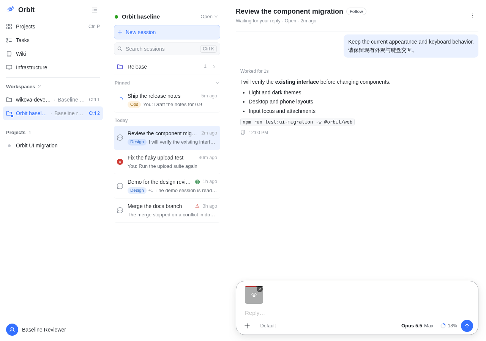

# 输入框缩略图预览按钮的可访问名称（P5/P2 跟进）

服务于 [P5/P2 跟进：输入框缩略图预览按钮的可访问名称](orbit-task:34dTUqxH5MjymjtUhs5C5)，项目验收条目 key `4Un2KxG0vLBv3dXWCfnqwK`：**P5：会话工作区完成迁移，输入、附件、富内容、消息操作及滚动导航行为无迁移回归。**

起因是 [P5.3](orbit-task:34Za39Ov1yysHZaYL6wgJ) 证据「未消除的差异」第 4 条（[p5.3/README.md](../p5.3/README.md#未消除的差异)）。输入框里新选图片的缩略图，迁移后由 Orbit `Image`（P5.2）画成可聚焦的预览按钮：Enter/Space 打开，关闭后焦点回到它。按钮的名称取 `alt`，而输入框沿用了 `alt=""`。协调者的 P5.3 判定 `61sATHPY66znwxRZorvP8d`（对 P5.3 证据第 1 版 `4YaPO25KrZzGyHllghOKYg` 的 CONFIRM），第 2 条写道：“输入框缩略图按钮无可访问名称——接受为已记录差异，修复牵涉新增文案与 P5.2 Image 接口，另立跟进任务处理（不塞进本版）”。本任务就是这项修复。

交付是一个提交 `01713ca80`，接在 origin/main `9274d5242` 上；本目录在它之上的提交里，见[提交](#提交)。

## 结论

| 验收要点 | 结果 |
| --- | --- |
| 按钮有可访问名称：取自文件名，或一条新增的英文短文案 | **修复前**：按钮的 `aria-label` 是空串。空的 `aria-label` 不算名称，浏览器转而从按钮的内容算名称，得到遮罩里眼睛图标的 `eye`：Chromium 自己的无障碍树（CDP）记的来源是 contents，Playwright 的计算也是 `button "eye"`。所以按钮没有一个属于这张图的名称；P5.3 README 写作“没有名称”，实测是这个图标名。**修复后**：按钮以文件名命名（`screenshot.png`），文件没有名字时用新增的 `Preview image`；Chromium 记的来源是 `aria-label`，内容里的 `eye` 标为 superseded。Chromium/WebKit × 桌面/手机 4 个环境都是这样，见[名称的前后对照](#名称的前后对照)。 |
| 单测断言名称存在、随内容正确，修复前红、修复后绿 | 新增 `WorkspaceView.composerThumbnail.test.tsx`：往输入框粘贴 `screenshot.png` 和一张没有文件名的图。两个缩略图都是 `role=button`、`tabIndex=0`，名称依次是 `screenshot.png`、`Preview image`，里面的 `` 都是 `alt=""`。`ImagePreview.test.tsx` 的 `Image` 一组加一例：`label` 给按钮命名，图片仍是 `alt=""`，打开的查看器仍以图片命名（`Image preview`）。修复前的源码上这两例失败、其余 13 例通过；交付上 15/15 通过。见[单测](#单测修复前红修复后绿)。 |
| `Image` 接口最小新增；既有调用方与默认行为不变；`alt=""` 的装饰语义保留 | `Image` 只多一个可选的 `label`，即按钮的名称，不传时仍取 `alt`（`aria-label={label ?? alt}`）；`` 的 `alt` 仍用调用方给的值。只有输入框新选图片的缩略图传 `label`。Transcript 的 `ChatImage`（Markdown 图片、会话产物、排队回合、“放回”输入框的图）不传，名称仍取 alt。P5.2 原有的 `Image` 单测原样通过；P5.2 用例两棵树的 trace 里，查看器名称与按钮逐步相同。 |
| 像素零变化，名称只出现在 trace/角色里 | 画出这个缩略图的浏览器用例是 P5.3 的附件用例（粘贴、悬停、打开预览、Esc、拖入、移除）：8 个环境 44/44 张截图逐字节相同；trace 只有焦点的名称不同（24 步：`button "eye"` → `button "screenshot.png"`）。P0 页面矩阵与 P5.2 查看器用例里没有一处画这个缩略图。P0 严格比较 101/101。逐字节比较时，两棵树同一遍之间有少数截图不同：P0 252 张里第 1 遍 11 张、第 2 遍 4 张，P5.2 240 张里 3 张、2 张。同一棵树跑两遍之间也有这么多：P0 参照 13 张、交付 10 张，P5.2 3 张、2 张。这些截图都在 Chromium，都不在输入框上，跨树最大的差别在同一棵树的两遍之间同样出现。所以 P0 与 P5.2 不是逐张逐字节相同，差别都在运行本身的波动之内，见[像素与 trace 的前后对照](#像素与-trace-的前后对照)。 |
| 组件矩阵 overlays、choices（八环境） | overlays 184/184 通过。choices 756 通过、20 失败：失败的是与 AntD 现场比较附件菜单的 5 个用例 × 4 个手机环境，在参照树（= main `9274d5242`）上逐条相同；在 P5.3 业务切换的父提交 `10e9c2bbf` 上这 5 个用例 × 8 环境 40/40 通过，从 `c868a02c2` 起失败。协调者已答复：记为缺口，这些比较用例由 P6 退场，不改夹具。见[组件矩阵](#组件矩阵)。 |
| 项目合并检查（build + 完整 Vitest）；OrbitKit | 合并检查（交付 `01713ca80`，任务工作树）：`tsc -b && vite build` 成功，Vitest 400 个文件、5165 个用例全部通过。OrbitKit 读 `WorkspaceView.tsx`，所以照规则跑：3669 个测试，5 个跳过，0 失败。 |

没有确立的部分见[未确立的部分](#未确立的部分)。

## 提交

| 提交 | 内容 |
| --- | --- |
| `01713ca80` | fix(web)：`Image` 的可选 `label`；输入框缩略图以文件名命名，没有文件名时为 `Preview image`（`PREVIEW_IMAGE_LABEL`）；`ui/README.md` 的 `Image` 一节；单测两处（见[单测](#单测修复前红修复后绿)）。撤回它就回到修复前，同提交参照树正是这样得到的。 |
| 本目录所在的提交 | docs：本目录。 |

## 跟上 origin/main

| 时刻（UTC） | origin/main | 做法 |
| --- | --- | --- |
| 开工（11:48） | `6fa5196e5`；项目 tip `a167c2ff0`（P5.3 落地）已含它 | 分支就在项目 tip 上，不用跟。 |
| 交付提交之后（12:01，正式轮之前） | `9274d5242`：把项目 tip `a167c2ff0` 合进 main，树与 `a167c2ff0` 逐字相同 | 项目 tip 已在 main 里，按规则直接 rebase 到 origin/main：`7fe367335` → `01713ca80`，树不变。之后 `audit-antd.mjs --check-owners` 退出 0：0 未归属、0 待定（[checks/start-check-owners.json](checks/start-check-owners.json)）。正式轮 f1 就在这个基础上。 |
| 交证据前（14:21） | `65fc7b41f`：`9274d5242` 之后 36 个提交，项目 tip `f1e5383b2` 已在其中 | `git merge-tree` 干跑无冲突（树 `b86dc5041`），main 没有改本批的文件。main 在 `src/web` 改的是被引任务的说明、`TaskStartCard`/`Transcript.referencedTask` 的测试和 `copyLanguage.test.ts` 的白名单（文案英文化），都不是本批依赖的公共层（`ui/`、index.css、弹层/通知）。按规则不再跟，只记下干跑与改动清单（[checks/merge-tree-newest-main.txt](checks/merge-tree-newest-main.txt)），由落地的合并检查兜底。同一时刻再跑 `--check-owners`：退出 0，0 未归属、0 待定（[checks/final-check-owners.json](checks/final-check-owners.json)）。 |

## 改动

- **`components/ui/Image.tsx`**：`ImageProps` 加 `label?: string`，按钮的 `aria-label` 由 `alt` 改为 `label ?? alt`。不传 `label` 时与以前逐字相同：`alt` 为空串时 `aria-label=""`，没有 `alt` 时不写 `aria-label`。`` 的 `alt` 和查看器的 `items` 都不变；查看器仍以图片的 alt 命名，没有 alt 时为 `Image preview`。
- **`components/WorkspaceView.tsx`**：新选图片的缩略图（有 `im.previewUrl` 的那一支）传 `label={im.name || PREVIEW_IMAGE_LABEL}`，`alt=""` 不变。`im.name` 就是 `file.name`，只有文件名为空时才用 `Preview image`。`||` 的写法同旁边 `addImage` 里的 `` `${file.name || 'File'} is empty` ``。
- **文案放在哪里**：Web 里唯一专门的文案模块是 `lib/runnerCopy.ts`，只收 Runners 页的句子。输入框自己的文案就在 `WorkspaceView.tsx` 里，有直接写在 JSX 上的（旁边的 `aria-label="Remove image"`、`"Add attachment"`），也有模块级的具名常量（`STICKY_LABEL = 'Your question'`）。新文案按后者写成具名常量 `PREVIEW_IMAGE_LABEL = 'Preview image'`，放在附件的其余常量（`ALLOWED_IMAGE_TYPES`、`MAX_IMAGE_BYTES`）旁边。它是英文，`copyLanguage.test.ts` 只数中文串，在完整 Vitest 里照常通过。
- **`components/ui/README.md`**：`Image` 一节写明 `label`，示例改为输入框的实际用法。
- **没有改的**：“放回”输入框的图（`AttachmentImage variant="chip"` → `ChatImage`）本来就有名称（alt `Image sent by user`），不在本任务范围，没有改成文件名。遮罩里的眼睛图标仍在按钮里，见[未消除的差异](#未消除的差异)。`components/ui/__fixtures__/ComposerFixture.tsx` 是 P3.1 拿 AntD `Image` 做对照的开发页，没有动。

## 名称的前后对照

[scripts/names.mjs](scripts/names.mjs) 由 [names-both.sh](scripts/names-both.sh) 在私有网络命名空间里起两棵树的生产构建，在 P0 + P5.3 的固定数据上打开会话，像 P5.3 附件用例那样往输入框粘贴两张图：`screenshot.png`，和一张没有文件名的图。然后读每个缩略图的 DOM、Playwright 算出的角色与名称（aria 快照）和按名称找到的按钮个数；Chromium 上再读浏览器自己的无障碍树（CDP `Accessibility.getPartialAXTree`，含名称来源）。最后在第一个缩略图上按 Enter 打开查看器、按 Esc 关闭，读此时拿着焦点的元素。原样输出：[names/names-ref.json](names/names-ref.json)（参照 `8b245fb69`）、[names/names-del.json](names/names-del.json)（交付 `01713ca80`）。

| | 修复前（参照） | 修复后（交付） |
| --- | --- | --- |
| 缩略图的 DOM | `span.orbit-image`，`role=button`，`tabindex=0`，`aria-label=""`；`` | 同左，只是 `aria-label="screenshot.png"` 与 `aria-label="Preview image"`；`` |
| Chromium 无障碍树：名称（来源） | 两个都是 `eye`（contents，即遮罩里图标的 `aria-label`） | `screenshot.png`、`Preview image`（attribute `aria-label`；contents 的 `eye` 为 superseded） |
| Playwright aria 快照 | `button "eye"`、`button "eye"` | `button "screenshot.png"`、`button "Preview image"` |
| `getByRole('button', { name, exact: true })` 找到的个数 | `screenshot.png` 0，`Preview image` 0，`eye` 2 | `screenshot.png` 1，`Preview image` 1，`eye` 0 |
| Enter 打开的查看器；其中的焦点 | `Image preview`；Close | 相同 |
| Esc 之后拿着焦点的元素 | 第一个缩略图，名称 `eye` | 第一个缩略图，名称 `screenshot.png` |

4 个环境（Chromium/WebKit × 桌面/手机，明色）的结果相同，页面没有报错。WebKit 上只有 Playwright 按规范算的名称，读不到 WebKit 自己的无障碍树。

## 单测（修复前红、修复后绿）

| 文件 | 用例 | 修复前的源码 | 交付 |
| --- | --- | --- | --- |
| `components/WorkspaceView.composerThumbnail.test.tsx`（新） | the thumbnail of a staged picture › is a button named by its file, or "Preview image" when the file has no name, over a decorative picture | 失败：`expected [ [ 'button', +0, '' ], …(1) ] to deeply equal [ …(2) ]`（两个名称都是空串） | 通过 |
| `components/ui/ImagePreview.test.tsx`（加一例） | Image › is named by its label when the picture is decorative, and the picture stays so | 失败：`expected '' to be 'screenshot.png'` | 通过 |
| `components/ui/ImagePreview.test.tsx` 其余 13 例 | 查看器 10 例；`Image` 3 例，含 “is a button named by the picture…”（不传 `label` 时以 alt 命名） | 通过 | 通过 |

做法见 [scripts/red-green.sh](scripts/red-green.sh)：在参照树（交付撤回修复）里写入交付的这两个测试文件，只跑这两个文件；再在交付树上跑同样两个文件；跑完把参照树还原。输出：[unit/before.txt](unit/before.txt)（2 失败、13 通过，退出 1），[unit/after.txt](unit/after.txt)（15 通过，退出 0）。完整 Vitest 在合并检查里。

## 像素与 trace 的前后对照

同提交对照：参照树是交付 `01713ca80` 撤回它自己（本地提交 `8b245fb69`，不推送，树与 origin/main `9274d5242` 逐字相同），交付树是 `01713ca80`。两棵树各自做生产构建，在 P0.2 的环境里（固定数据与时间、`reducedMotion: 'reduce'`、各自的网络命名空间、6G 内存上限）逐步串行地跑，见 [scripts/formal.sh](scripts/formal.sh)，正式轮 f1。修复唯一改到的 DOM 是本地新选图片缩略图上的 `aria-label`，这个属性不参与排版和绘制。

**P5.3 的附件用例**（画出这个缩略图的唯一一组浏览器用例：粘贴 `screenshot.png`、上传中、上传后、悬停、点开预览、Esc、拖入一个 PDF、移除）：两棵树 8/8 通过；44/44 张截图逐字节相同，计算样式没有差别（[compare/p53att-summary.json](compare/p53att-summary.json)）。trace 60 步里有 24 步不同（[compare/p53att-trace-semantics.json](compare/p53att-trace-semantics.json)），而且只差焦点的名称：8 个环境 × 预览关闭后的 3 步（closed with Esc、a file dragged over the conversation、dropped），焦点都在缩略图上，参照记作 `{"role": "button", "name": "eye"}`，交付记作 `{"role": "button", "name": "screenshot.png"}`。输入框状态、附件条、对话框、请求都相同。两棵树的 trace 原样在 [traces/](traces/)。悬停时的缩略图（两棵树逐字节相同，sha256 见 [shots/sha256.txt](shots/sha256.txt)）：



**P0 页面矩阵与 P5.2 查看器用例**：P0 的会话场景放进输入框的是文件条（`.composer-file`），不是图片；P5.2 只有“放回”输入框的图，由 `ChatImage` 画、不传 `label`。所以这两组里没有一处画到修复改了的 DOM，它们说明的是“别处没有动”。

- P0 严格比较（交付对参照写出的截图，P0 比较器、`maxDiffPixels: 0`）：101 通过、11 跳过（同 P0 基线），没有失败（[runs/p0-strict.txt](runs/p0-strict.txt)）。
- 两棵树各自写截图后逐字节比较：P0 252 张里 241 张相同；P5.2 240 张里 237 张相同，两棵树 56/56 通过。不相同的都在 Chromium、都不在输入框上（[compare/analyze.txt](compare/analyze.txt)）。为了分清这是修复带来的还是运行本身的波动，两棵树各再跑一遍（[scripts/noise.sh](scripts/noise.sh)），对四次运行两两逐字节比较（[scripts/analyze-noise.py](scripts/analyze-noise.py)，[compare/p0-noise.txt](compare/p0-noise.txt)、[compare/p52-noise.txt](compare/p52-noise.txt)）：

| 比较 | P0（252 张）相同 / 抗锯齿级 / 超出 | P5.2（240 张）相同 / 抗锯齿级 / 超出 |
| --- | --- | --- |
| 参照 第 1 遍 ｜ 交付 第 1 遍（跨树） | 241 / 10 / 1 | 237 / 1 / 2 |
| 参照 第 2 遍 ｜ 交付 第 2 遍（跨树） | 248 / 4 / 0 | 238 / 0 / 2 |
| 参照 第 1 遍 ｜ 参照 第 2 遍（同一棵树） | 239 / 11 / 2 | 237 / 0 / 3 |
| 交付 第 1 遍 ｜ 交付 第 2 遍（同一棵树） | 242 / 9 / 1 | 238 / 1 / 1 |

“抗锯齿级”是每个通道差不超过 2，“超出”是更大的差（P3.1/P3.2 的分类）。逐张看：
- **P0**：跨树唯一超出的一张 `chromium-dark-desktop/breakpoint-639-projects`（7 个像素、最大差 4）在参照自己的两遍之间同样出现，交付两遍和参照第 2 遍画的是同一张。其余是项目列表、资料页校验、设置保存、任务详情里 3–56 个像素的抗锯齿级差别，同一棵树的两遍之间也是这几页。
- **P5.2**：`p52-diagram-focus`（Chromium 两个手机环境）是 P5.2 README 已记录的那一步的不确定：键盘把焦点移到 Markdown 图片后，会话停在 113 或 110，差 3px。交付在暗色手机上两种都画过，参照在明色手机上两种都画过。`p52-result`（暗色桌面，11 个像素、最大差 2）在交付自己的两遍之间就不同。第 2 遍跨树的两张（暗色手机的 `p52-streaming`、`p52-tail`）来自参照的第 2 遍：图片陆续画出时会话没有停在尾部（到尾部的距离 210 → 1428px），这是 P5.2 README「未消除的差异」第 3 条记录的跟随尾部偶发失效。它出现在没有修复的参照上，交付两遍都停在尾部；这只说明它是已有缺陷，不说明修复改变了它。
- **P5.2 的 trace**（[compare/](compare/) 下的 `p52-trace-semantics*.json`）：语义不同的步只在图片的盒、占位与滚动位置上。跨树：第 1 遍 2 步（上面的 3px）；第 2 遍 7 步，都是参照第 2 遍在 Chromium 暗色手机上没有停在尾部（3 个用例）。同一棵树：参照两遍之间 8 步，交付两遍之间 1 步。查看器的名称、按钮、焦点、请求与对象 URL 在每一对里都逐步相同。

结论：没有一张截图的差别来自修复。逐张逐字节相同在 P5.3 附件用例里成立（44/44）。P0 与 P5.2 里，两棵树之间的每一处差别都在同一棵树两遍之间的波动范围内：张数相当，页面相同，最大的那处在同一棵树的两遍之间同样出现。

## 组件矩阵

- **overlays**（`ui-migration/overlays.config.mjs`，八环境，交付）：184 通过（[runs/overlays.txt](runs/overlays.txt)）。
- **choices**（`ui-migration/choices.config.mjs`，八环境，交付）：756 通过、20 失败（[runs/choices.txt](runs/choices.txt)）。20 个失败是 5 个用例 × 4 个手机环境，都是拿 Orbit 附件菜单与 AntD 参照样例现场比较的用例：`choices.browser.mjs:83` “attachment matches the current surface, density and option states”，`choices-motion.browser.mjs:104` “normal bottom/top/flipped entrance and exit motion matches attachment”（3 个），`choices-first-frame.browser.mjs:177` “menu is drawn where it settles from its first frame…”（它的样例就是附件菜单）。手机上 AntD 样例按桌面密度画（130.06 × 177，12px 深色图标），Orbit 附件变体按 P2.2 的手机密度画（250 × 240.95，19px `#8a8a8e` 图标）。
  - **从哪里开始**（[scripts/choices-origin.sh](scripts/choices-origin.sh)，这 5 个用例 × 8 环境，四棵树，[runs/choices-origin/](runs/choices-origin/)）：交付 20 失败、20 通过；参照（= main `9274d5242`）20 失败、20 通过，失败的用例逐条相同；P5.3 业务切换 `c868a02c2` 20 失败、20 通过，同样逐条相同；它的父提交 `10e9c2bbf` 40/40 通过。原因：`c868a02c2` 删掉了 index.css 里被替换的 composer + 菜单的手机规则（`.composer-attach-menu.ant-dropdown-menu …`），而 `ChoicesFixture.tsx:67` 仍给 AntD 参照样例加 `composer-attach-menu` 类，它的手机密度靠的正是这些规则。这是夹具里比较用的参照样例的问题，不是产品：输入框本身用的是 Orbit 的附件变体。
  - **协调者的处置**（回复请求 `34dXJfuVO7QQ2xyI1E7QY`）：记为缺口提交，不另立夹具修复任务。这 5 个是与 AntD 现场比较的 b 类用例（几何、动效、首帧），[P6](orbit-task:34Za39RS6A28G7xPqMD0p) 按协调者的判定删除六个共存夹具里与 AntD 现场比较的用例，它们由 P6 退场；本任务不改夹具、不改 Menu。协调者也已告诉 P6，这 20 条在 P6 之前的基线上两棵树同为红。

## 标准 P0、合并检查与 OrbitKit

- **标准 P0**（期望截图 = P0.2 原图 + 已登记的层，交付与参照各跑一遍）：两棵树都是 95 通过、6 失败、11 跳过。失败的 6 个用例逐个相同，首行错误相同，6 张实际截图逐字节相同（[compare/p0-standard-compare.txt](compare/p0-standard-compare.txt)）。这 6 张就是 P5.3 交给登记的迁移差异：两个明色桌面的 `session-attachment-staged`，四个手机的 `session-attachment-menu`。正式轮的基础 `9274d5242` 上还没有登记；交证据前的 origin/main `65fc7b41f` 已含 P5.3 的 P0 登记（`f1e5383b2`，已接受层里 8 条 `session-attachment-*`），本任务没有在新的 main 上重跑标准 P0。
- **合并检查**（项目规则：在任务工作树上跑）：`npm run build -w @orbit/web && npm run test -w @orbit/web`，交付 `01713ca80`：`tsc -b && vite build` 成功，Vitest 400 个文件、5165 个用例全部通过，退出 0（[checks/merge-check.txt](checks/merge-check.txt)）。P5.3 交付时是 399 个文件、5163 个用例；多出的数目与本任务新增的一个文件、两个用例相符。
- **OrbitKit**：多个原生对照测试逐字读取 `WorkspaceView.tsx`（`ComposerMenuCopyParityTests`、`WatchWakeCopyParityTests`、`StartProjectCardCopyParityTests` 等），本任务改了这个文件，所以照规则在交付检出上跑 `docker … swift:6.1 swift test`：3669 个测试，5 个跳过，0 失败（[checks/swift.txt](checks/swift.txt)）。没有一个对照锚在缩略图的标记上。

## 未消除的差异

1. **遮罩里的眼睛图标仍在按钮里**：`cover` 是 `<EyeOutlined className="composer-attach-eye" />`，`@ant-design/icons` 把它画成 `span role="img" aria-label="eye"`。修复后按钮的名称来自 `aria-label`，图标不再进入名称，但它仍是按钮的子节点：Playwright 的快照里，`button "screenshot.png"` 下面是 `img "eye"`。按 WAI-ARIA 1.2，button 的子节点是展示性的（Children Presentational: True）。把图标标成 `aria-hidden` 是另一处改动，本任务没有做。
2. **查看器的名称**：从这个缩略图打开的查看器仍以图片的 alt 命名，`alt=""` 时是 `Image preview`，与修复前相同。`label` 只给缩略图按钮命名，单测钉住了这一点。

## 未确立的部分

- **choices 矩阵没有全部通过**：20 个失败在参照（= main `9274d5242`）上逐条相同，从 P5.3 的 `c868a02c2` 开始，见[组件矩阵](#组件矩阵)。按协调者的答复记为缺口，由 P6 退场。
- **P0 与 P5.2 不是逐张逐字节相同**：每一处差别都落在同一棵树两遍之间的波动范围内，见上表。这是用两遍运行量出来的；没有更多遍数，变体的分布只看到这两遍里出现的那些。
- **读屏软件**：没有用 VoiceOver、NVDA、TalkBack 实测。名称在 Chromium 自己的无障碍树里量到（CDP），WebKit 上只有 Playwright 按规范算的名称。真机检查按项目安排在 P7.2。
- **新的 main**：交证据前 main 前进到 `65fc7b41f`，只做了干跑（无冲突、没有改本批的文件），没有在合并树上重跑；按项目规则由落地的合并检查兜底。

## 复现

```bash
# 两棵树（都在 /mnt/data/tmp/34dTUqxH5MjymjtUhs5C5/v1）：参照 = 交付撤回修复；del = 交付
scripts/make-trees.sh 01713ca80794e84e570378824d1632c5076ee314 01713ca80794e84e570378824d1632c5076ee314
scripts/chain.sh f1        # formal.sh f1：P0 矩阵一对与严格比较、P5.2 一对、P5.3 附件用例一对、标准 P0 两棵树、overlays、choices；
                           # 再 names-both.sh、red-green.sh、合并检查（任务工作树）、OrbitKit（docker swift:6.1，交付树）
scripts/analyze.sh f1      # 截图逐字节、计算样式、trace 逐字段；标准 P0 的失败对照；组件矩阵的结果
scripts/noise.sh f1        # P0 矩阵与 P5.2 在两棵树上各再跑一遍
python3 -I scripts/analyze-noise.py <v1/f1> p0; python3 -I scripts/analyze-noise.py <v1/f1> p52
scripts/choices-origin.sh f1 '\bmenu is drawn where it settles|motion matches attachment|attachment matches the current surface'
scripts/collect.sh f1      # 收进本目录
```

## 证据体积

本目录约 5.6 MB（上限 30 MB）：运行日志与报告摘要 4.9 MB（`report-summary.py` 去掉附件正文，没有 trace.zip；其中 choices 的报告摘要 1 MB），截图两张与哈希 0.2 MB，比较 0.2 MB，P5.3 附件用例两棵树的 trace 0.1 MB，名称探针、单测输出、检查与脚本共 0.1 MB。没有收进来的原始运行（两棵树每一遍的全部截图、Playwright 报告与附件）留在 `/mnt/data/tmp/34dTUqxH5MjymjtUhs5C5/` 直到判定。
