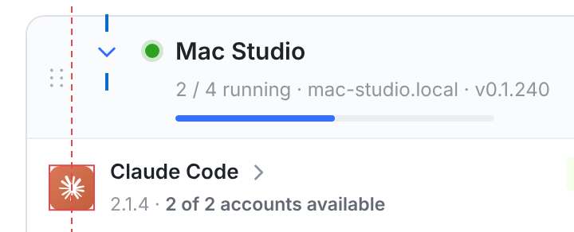
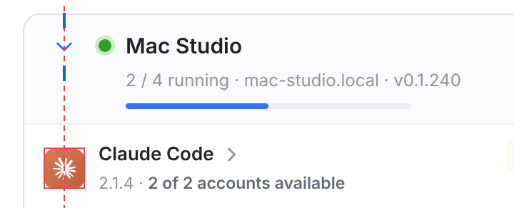
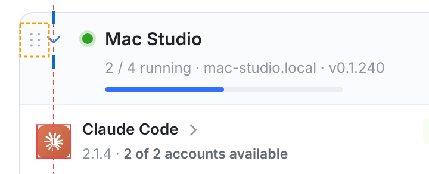
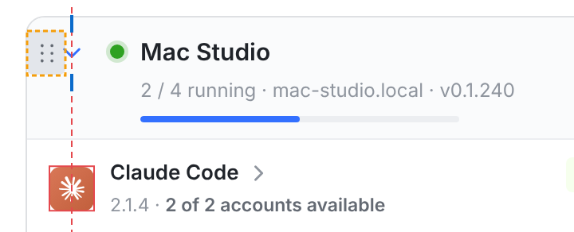
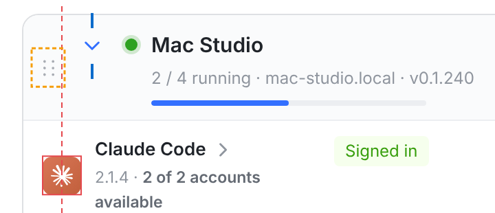
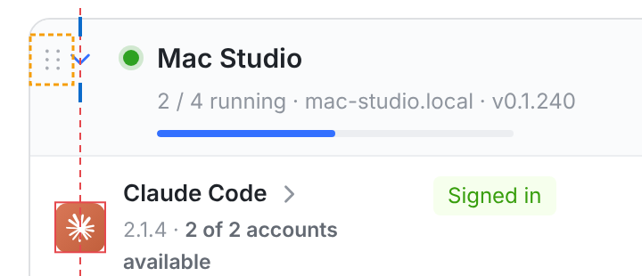

# 机器卡片头：拖拽把手挪进卡片左边距，折叠箭头回到引擎图标列 — 验证

代码在提交 `73162305d`，基于项目线 `6baf92736`（已含 P5 的 `c7aa27d2e`）。只改了两个文件：

- `src/web/src/index.css`：机器卡片头里与 `.re-drag` 相关的规则（`.re-runner-card .re-head`、`.re-runner-card .re-drag`，以及窄卡片 `@container re-card (max-width: 600px)` 里的对应规则）。没有新增类名，也没有新增顶层选择器：`position: relative` 写进了原有的 `.re-runner-card .re-head` 规则里，因为 `src/indexCss.test.ts` 要求每个顶层选择器只写一次。
- `src/web/src/pages/InfrastructurePage.machines.test.tsx`：用例。

`RunnerEngines.tsx` 没有动。把手仍是卡片头的第一个元素，`@dnd-kit` 的绑定、`POST /runners/reorder`、`aria-label`、Tab 顺序都和原来一样。变的只是：在宽卡片里，它不再占卡片头的排版流。

## 1. 做法

改前，P1 的把手在卡片头的排版流里：左外边距 6px、宽 24px、右外边距 −8px，净占 22px。main 的 092d86649 / c9ed8836c 把折叠箭头放在卡片头最前面，让它与下面各行的引擎图标同列。把手在它前面，于是箭头被推右了 22px，状态圆点也比引擎名字列偏右 22px。

| | 改前 | 改后 |
| --- | --- | --- |
| 宽卡片（卡片内宽 > 600px：桌面、平板） | 把手在排版流里，箭头和圆点右移 22px | 把手 `position: absolute`，贴着卡片内沿（`left: 0`），在卡片自己的左侧留白里；`top: 8px`，中心与箭头同一行。箭头回到引擎图标列，圆点回到引擎名字列 |
| 能悬停的设备（`@media (hover: hover)`） | 把手一直显示 | 平时 `opacity: 0`。指针在卡片上、键盘焦点在把手上（`:focus-visible`）、或正在拖拽时显示。它只是透明，没有 `display: none`，所以一直在 Tab 顺序和无障碍树里 |
| 触屏（无悬停） | 一直显示 | 一直显示 |
| 窄卡片（≤ 600px，手机） | 把手在卡片头 grid 第 1 列，箭头在右上角（main 的设计） | 不变。手机截图改前、改后逐像素相同（见第 2 节） |

把手大小仍是 24×28，点击目标和原来一样大。

它的悬停/焦点底色占 x 0–24。收起时箭头笔画从 25.3 开始，两者不重叠。展开时箭头旋转 90°，笔画尖端在 22.6。旋转的元素画在前面那个绝对定位的把手之后，所以箭头尖端仍画在把手底色之上。

### 为什么放在卡片内的左侧留白，而不是卡片外的页边

“卡片左侧留白”有两种读法：卡片自己左内边距的 14px，或卡片外面的页面边距。我选了前者，原因有三：

- `.re-card` 是 `overflow: hidden`（为了圆角裁切），卡片里的元素画不到卡片外面。要放到外面，就得把把手从卡片里拆出去，再给卡片包一层可排序的容器。
- 视口 ≤ 960px 时，页面左边距只有 16px，而平板宽度下卡片仍是宽布局：24px 的把手放不下，会被页面滚动容器裁掉一截。
- 平板上把手会贴着屏幕左边缘，那里容易和系统的边缘手势抢触摸。

放在卡片自己的左侧留白里，在每一种宽卡片宽度下都一样。实现只改 CSS，卡片头的 DOM 不变。

## 2. 量出来的位置（真实控制台）

真实控制台：vite 跑本工作树，Chromium headless，浏览器里拦截 `/api/**` 作为假 API。数据沿用 `../p3/shot.cjs` 的三台机器：Mac Studio（展开）、HPC（折叠）、ThinkPad（离线、折叠）。脚本是 [`shot.cjs`](shot.cjs)。

两组截图的唯一区别是页面加载的 `index.css`：

- 改前 = blob `6d338d88c`，即 `6baf92736` 的版本；
- 改后 = blob `6ee8c9217`，即 `73162305d` 的版本。

每张卡片头上箭头的中心（`.re-chev` 盒子中心；展开时旋转 90°，中心不变），对比引擎行图标（`.re-row[data-engine] > .re-id > .provider-tile`，28px）的中心，单位 CSS px：

| 场景 | 改前：箭头 − 图标 | 改后：箭头 − 图标 |
| --- | --- | --- |
| 桌面 1440，三张卡片 | 461.0 − 439.0 = **+22.0** | 439.0 − 439.0 = **0.0** |
| 平板 820（触屏），三张卡片 | 67.0 − 45.0 = **+22.0** | 45.0 − 45.0 = **0.0** |
| 手机 390（触屏） | 箭头在右上角（345.0），按 main 的设计不在图标列 | 同左 |

验收线是偏差 ≤ 2px，改后三张卡片在桌面和平板上都是 0.0px。箭头笔画中心与盒子中心的差在 0.3px 以内，见 `*-measure.json` 里的 `chevronInk`。

同一组测量里的另外几项：

- **状态圆点**：左沿从 485 回到 463，等于引擎名字列 463。这正是 main 在 c9ed8836c 效果图里要的“圆点 = 引擎名字列”。
- **桌面把手**：从 x 417–441（排版流里，竖直居中于整个卡片头）挪到 x 411–435。卡片内沿是 411，所以把手完全在卡片里。它的竖直中心与箭头中心都在卡片头顶部下方 22.0px。
- **手机**：三张卡片的把手都在 x 23–47、一直显示；名称从 x 74 起，相距 27px，不重叠。改前、改后的原始截图逐像素相同（`PIL ImageChops.difference` 的 bbox 为空）。

### 截图

第一张卡片头和它下面第一行的放大图。红色虚线和红框 = 引擎图标列，蓝色短线 = 箭头中心，橙色虚框 = 把手：

| 改前 | 改后 |
| --- | --- |
|  桌面 |  桌面，指针不在卡片上：把手隐藏 |
| |  桌面，指针在卡片头上：把手出现在左侧留白里 |
| |  桌面，键盘 Tab 到把手：焦点底色 |
|  平板（触屏） |  平板（触屏）：把手一直显示 |

整段 Machines 区的标注图（每张图顶部写着测量值，右侧逐卡写着偏差）：

- 桌面：[`before-desktop.png`](before-desktop.png) → [`after-desktop.png`](after-desktop.png)、[`after-desktop-hover.png`](after-desktop-hover.png)、[`after-desktop-focus.png`](after-desktop-focus.png)
- 平板：[`before-tablet.png`](before-tablet.png) → [`after-tablet.png`](after-tablet.png)
- 手机：[`before-phone.png`](before-phone.png) → [`after-phone.png`](after-phone.png)
- 全部测量值：[`before-measure.json`](before-measure.json)、[`after-measure.json`](after-measure.json)

## 3. 用例

都在 `src/web/src/pages/InfrastructurePage.machines.test.tsx`，用的是真实的 `InfrastructurePage` 和假 `api`：

| 验收条目 2 的哪一项 | 用例（describe › it） |
| --- | --- |
| 拖拽把手仍在，可键盘聚焦，排序仍发出 `POST /runners/reorder` | a machine card’s handle and ⋯ › moves a machine down by its handle from the keyboard, and saves the new order。原有用例，补了一句断言：`focus()` 之后 `document.activeElement` 就是把手。然后用 Space、ArrowDown、Space 移动卡片，断言发出 `POST /runners/reorder {ids: [workstation, wikova, mac-mini]}` |
| 拖拽把手仍在、可聚焦，且不会被当成折叠 | a machine card’s handle and ⋯ › heads the card with its handle, first to the keyboard, and folds nothing by it（新增）。断言卡片头上 Tab 依次停在 `Reorder wikova`、`Expand wikova`、`Details of wikova`、`More actions for wikova`；把手有 `aria-roledescription="sortable"` 和 `title="Drag to reorder"`，`focus()` 后成为 `document.activeElement`；点它，卡片不展开 |
| 折叠箭头仍能开合卡片 | a machine card’s head on /infrastructure › folds open and shut from the chevron that leads it（新增）。断言箭头是折叠按钮的第一个元素；点击后 `aria-expanded` 由 false 变 true，标签变成 `Collapse wikova`，箭头加上 `open`，引擎行出现；再点一次，`aria-expanded` 回到 false，引擎行消失 |
| 把手不占宽卡片头的排版流（对齐本身的回归保护） | where a machine card’s handle stands › stays out of a wide head’s flow, so the chevron leads it in the engine icons’ column（新增）。jsdom 不做布局，所以直接读 `index.css`。断言三点：宽卡片规则是 `position: absolute; left: 0`；窄卡片规则是 `position: static` 加 `grid-column: 1`；隐藏规则只在 `@media (hover: hover)` 和 `@container re-card (width > 600px)` 之下，只写 `opacity: 0`，并排除 `:focus-visible` |

最后一个用例在改前的样式表上会失败：`expected 'margin: 0 -8px 0 6px;' to match /position: absolute;/`。这在本任务会话里跑过一次（临时换回 `6baf92736` 的 `index.css`，跑完即恢复）。

## 4. web 全量对比与 OrbitKit

**web**：`vitest run --maxWorkers=2`，每棵树分 6 片跑，每片在自己的内存上限 scope 里。各片报告合并后，用 [`../p1/compare.mjs`](../p1/compare.mjs) 对比。

| 树 | 用例 | 通过 | 失败 | 文件 |
| --- | --- | --- | --- | --- |
| 干净 main `fadc587b0`（main 在 `cbe6a6635` 合入了本项目线 `6baf92736`） | 4884 | 4884 | 0 | 374 |
| 本分支 `73162305d` | 4887 | 4887 | 0 | 374 |

本分支独有的失败：无。两边的测试文件完全相同，多出的 3 个用例就是第 3 节新增的三个。

第一次全量跑在 `b868ad0c3` 上，那次 `src/indexCss.test.ts › index.css writes each top-level rule once` 红了：我把 `position: relative` 写成了第二条顶层 `.re-runner-card .re-head` 规则。`73162305d` 把它并进了原有规则。合并前后，改后截图在 5 个场景下都逐像素相同，所以本目录的截图对最终版本成立。

**OrbitKit**：本改动动了 OrbitKit 会读的 `src/web/src/index.css`（`WikiCopyParityTests` 读其中 Wiki 的手机规则），所以在 docker `swift:6.1` 里跑了 `swift test`。用的是 `73162305d` 的 `git archive`（不含 `docs/evidence/base-ui-migration`），A/B 只换 `index.css`：

| 树 | 结果 |
| --- | --- |
| 本分支 `73162305d`（index.css `6ee8c9217`） | Executed 3527 tests, with 5 tests skipped and 0 failures，退出码 0 |
| 同一棵树，index.css 换回 `6baf92736` 的 `6d338d88c` | Executed 3527 tests, with 5 tests skipped and 0 failures，退出码 0 |

本分支独有的失败：无。

## 5. 复现

```sh
# 在本工作树：npm ci --ignore-scripts --no-audit --no-fund --prefer-offline
cd src/web && npx vite --port 5491 --strictPort --host 127.0.0.1 &
cd ../.. && FONTCONFIG_FILE=<Inter + Noto Sans SC 的 fonts.conf> \
  node docs/evidence/infrastructure-page/chevron-align/shot.cjs src/web http://127.0.0.1:5491 <out> after
# 改前：先把 src/web/src/index.css 换成 git show 6baf92736:src/web/src/index.css，用标签 before 再跑一遍，然后恢复
```

`shot.cjs` 会写出标注图 `<label>-<scene>.png`、卡片头放大图 `<label>-<scene>-head.png`、`<label>-measure.json`，以及原始截图 `raw/<label>-<scene>.png`（原始截图没有提交）。
