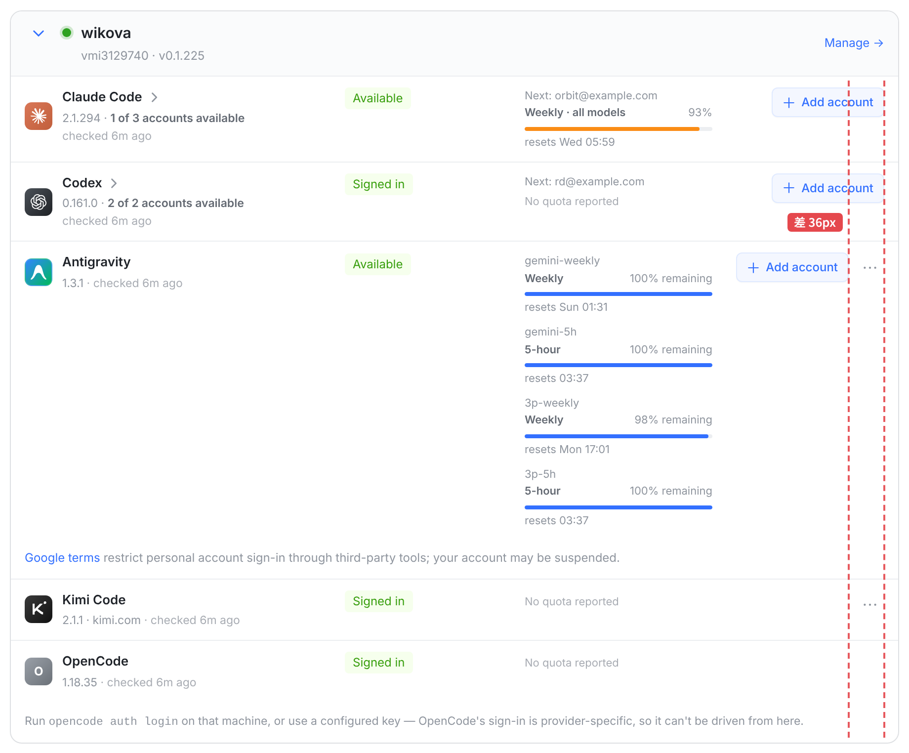
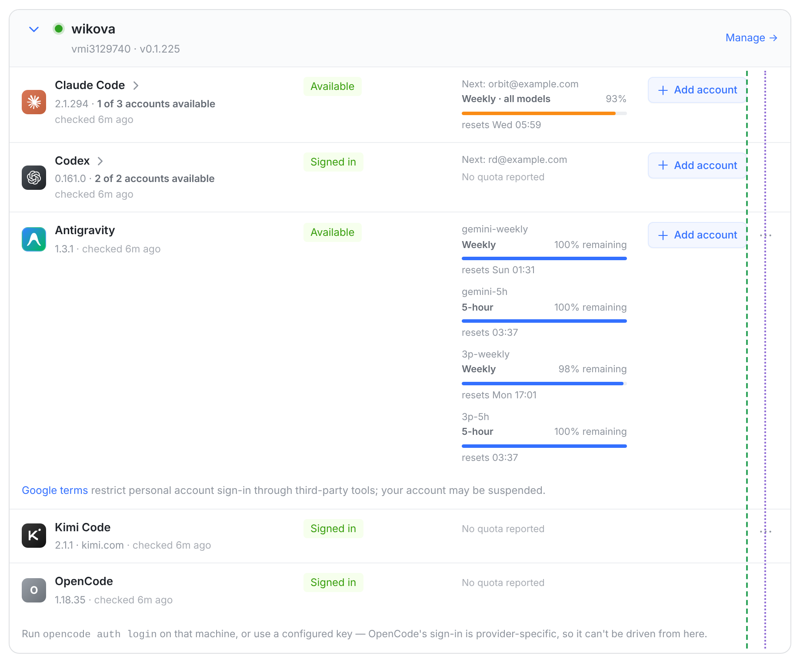
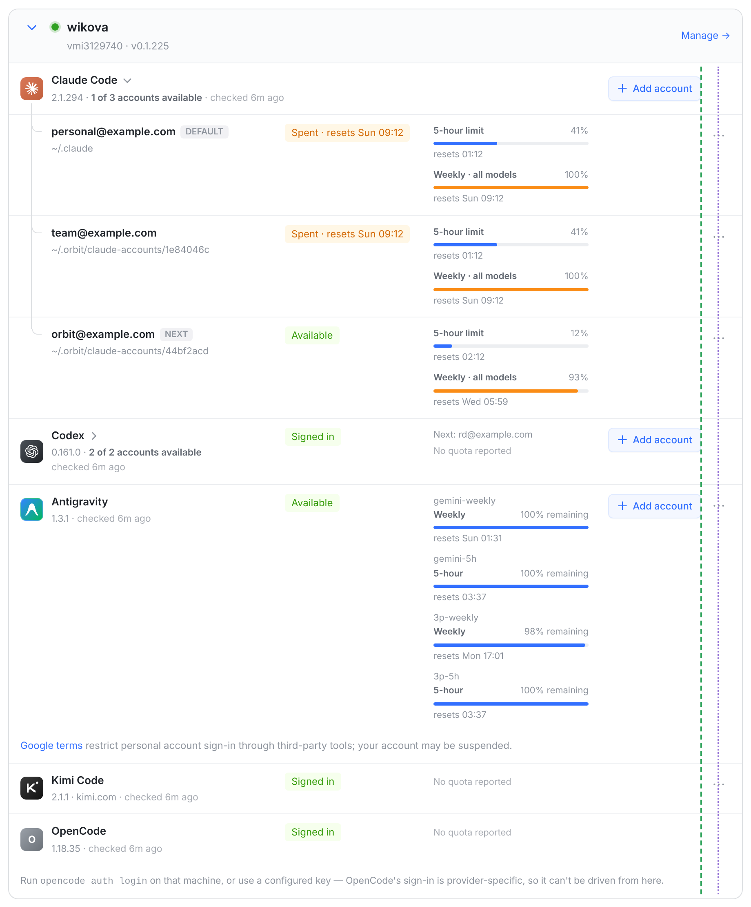
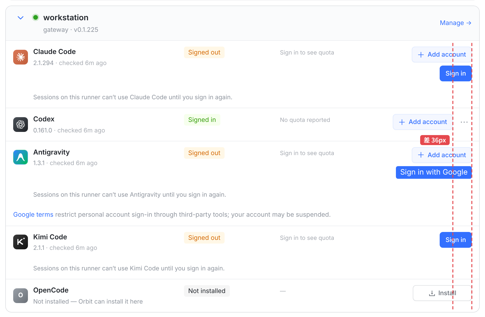
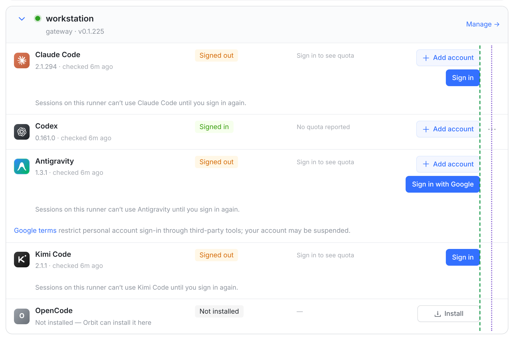
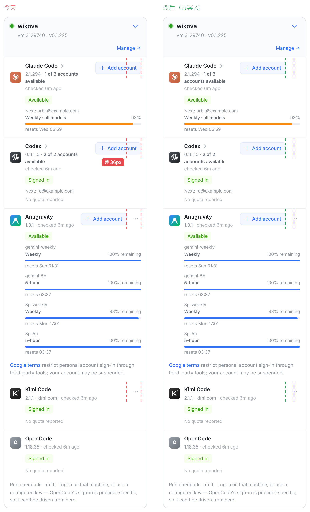
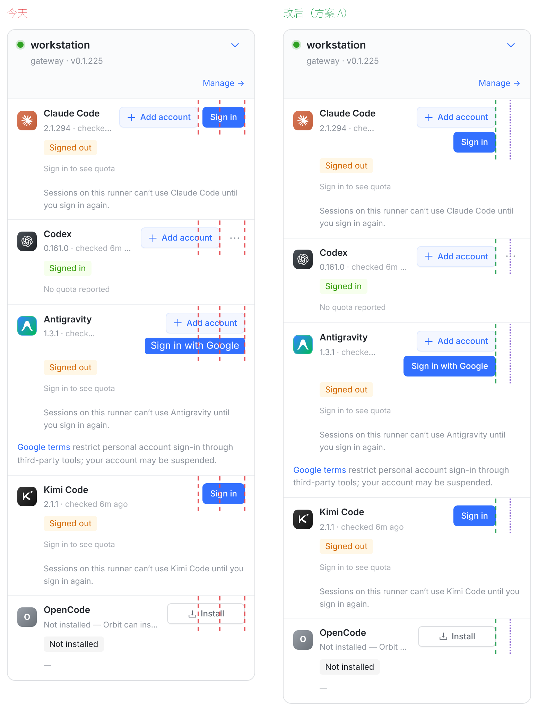
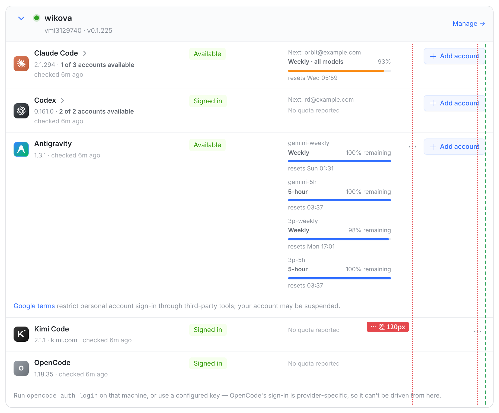

# Add account 按钮对齐：每行最右给 ⋯ 留固定位（效果图，代码还没改）

截图来自 Providers 页的「On your runners」。都是真机截图：本机 vite 加假 API，数据按你截图里的 wikova 造，邮箱换成了示例地址。
图上的标线：
- 红虚线：Add account 右沿对不齐。
- 绿虚线：Add account 右沿对齐了。
- 紫点线：`⋯` 那一列。

## ① 今天：有 ⋯ 的行把 Add account 往左挤了 36px

每行最右是一块 160px 宽的操作区，按钮靠右排。

- Antigravity 那行除了 Add account 还有一个 `⋯`（30px 宽，再加 6px 间距）。
- Claude Code 和 Codex 是账号组的头行，没有 `⋯`，Add account 就直接贴到最右。

所以两种行差了 30 + 6 = **36px**。

| 行 | 操作区里有什么 | Add account 右沿 (px) |
|---|---|---|
| Claude Code | Add account | 885 |
| Codex | Add account | 885 |
| Antigravity | Add account · ⋯ | **849** |

## ② 建议（方案 A）：每行最右都给 ⋯ 留位，没有 ⋯ 就空着

| 行 | 今天 | 改后 |
|---|---|---|
| Claude Code 的 Add account | 885 | **849** |
| Codex 的 Add account | 885 | **849** |
| Antigravity 的 Add account | 849 | 849 |
| ⋯（Antigravity、Kimi Code） | 855–885 | 855–885 |

改后 Add account 排成一列，`⋯` 也排成一列。

- 有 `⋯` 的行一个像素都不动，包括 Antigravity、Kimi Code，以及账号组展开后的每个账号行。
- 只有没有 `⋯` 的行会变：按钮往左让出 36px。

**展开账号组时也对齐。** Claude Code 展开后，头行的 Add account 还在这一列；下面每个账号行的 `⋯` 都在 `⋯` 那一列。

**其它按钮也跟着对齐。** 我另造了一台机器，把剩下几种按钮组合都摆上：

- 未登录：Add account 加 Sign in
- 只有 Sign in
- Install
- Sign in with Google

今天这些按钮的右沿有 885 和 849 两个位置。改后全部落在 849，`⋯` 在 855–885。

今天：

改后：

**手机上同样适用。** 今天 Add account 的右沿是 343 和 307 两个位置，改后都在 307。

窄卡片（646px，名字一行、按钮一行的那种布局）我也量了：今天是 631 和 595 两个位置，改后都在 595。

## 方案 A 附带两处小改动（不改会出新问题）

1. **手机上名字那一列的最小宽度从 112px 改成 120px。**
   - 问题：留位以后，「未登录的单账号 Claude Code」那行（Add account 加 Sign in）在手机上会把名字挤成「Claude / Code」两行。「Claude Code」需要 28 + 10 + 81 = 119px。
   - 改后：名字保持一行，两个按钮折成两行（右图第一行）。其它行在手机上不受影响。

   

2. **Sign in with Google 换成同列按钮的样式**（`re-action`：12px 字、30px 高）。
   - 现状：这一列只有它没用这个样式。它是 14px 字，比旁边的 Sign in 明显大一号（见上面「今天」那张图），宽 144px。
   - 问题：留位后操作区只剩 124px，它会伸进左边的配额列。
   - 改后：宽 132px，只伸进 14px 的列间距 8px，碰不到配额列。

## 待定 · 要你拍板

**方案 A（推荐）：给 ⋯ 留固定位。**
- 好处：Add account 和 `⋯` 两列都对齐，有 `⋯` 的行完全不动。
- 代价：没有 `⋯` 的行，最右边空出 36px。

**方案 B：Add account 永远贴最右，`⋯` 挪到它左边。**

Add account 是对齐了，但 `⋯` 分成了两列：Antigravity 的在 Add account 左边，Kimi Code 的在最右，相差 120px。而且「更多」放在主按钮前面不合惯例，这一页的 `⋯` 都在行尾。不推荐。

另一个思路是给账号组头行也加一个 `⋯`，我没有采用。头行没有属于引擎本身的菜单项，只为占位造一个空菜单不值得。

## 落地（按代价排）

1. **方案 A，约 10 行改动：**
   - `src/web/src/index.css` 加一条规则：`.re-runner-card .re-act:not(:has(.re-more)) { padding-right: 36px }`。
   - 手机那条 `minmax(112px, 1fr)` 改成 `minmax(120px, 1fr)`。
   - `RunnerEngines.tsx` 给 Sign in with Google 加上 `className="re-action"`。
   - 只作用于 runner 卡片（`.re-runner-card`）。账号池页面也用 `.re-act`，但不受影响。
2. **方案 B：** 只要 1 条 CSS（`order: -1`），但 `⋯` 仍然对不齐。

复现脚本在 `/var/tmp/add-account-align/`：
- `server.mjs`：假 API，端口 3491。
- `vite.config.mjs`：端口 5491。
- `capture.mjs`：截图并测量位置；方案 A/B 的 CSS 在这里注入。
- `shots.sh`：全部重拍。
