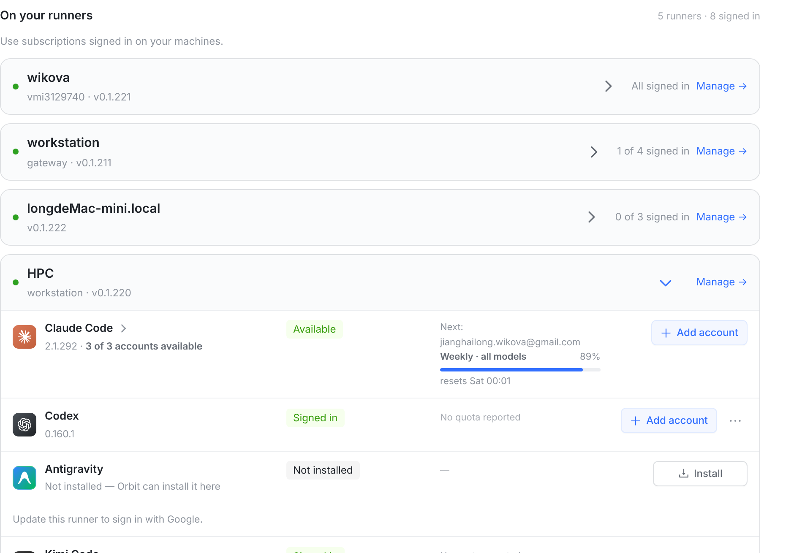
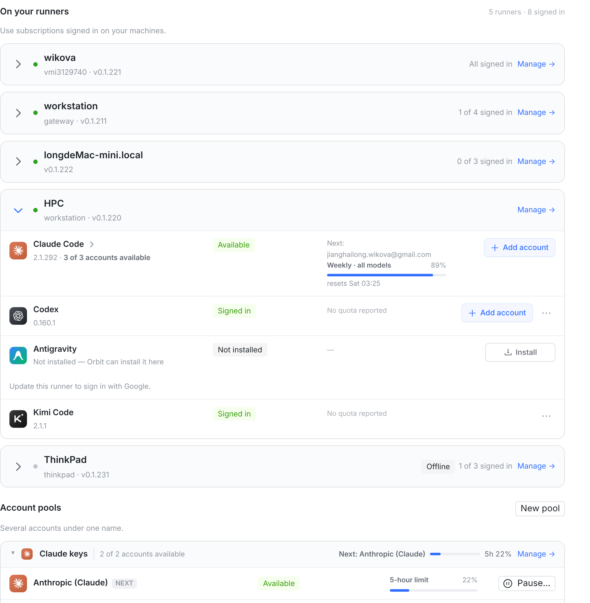
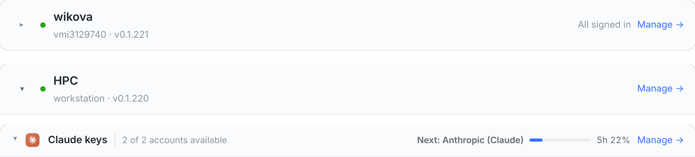
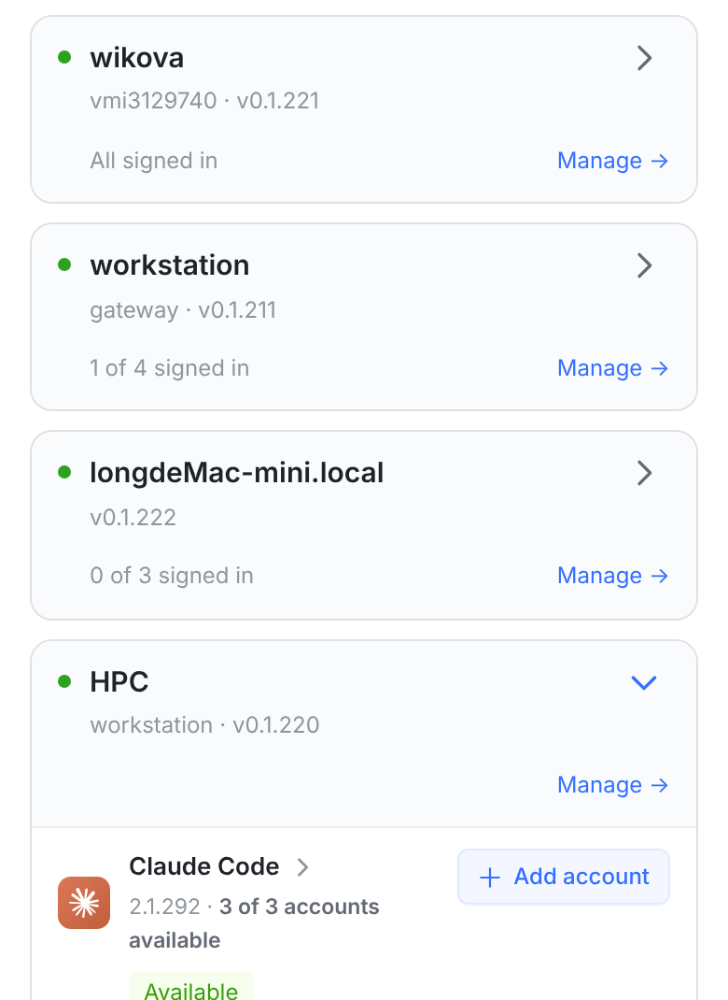

# 展开/收起的倒三角：挪到最左 + 用账号池那种小三角（效果图，代码还没提交）

Providers → “On your runners”。真机截图（本机 vite + 假 API，数据照你截图里的机器造的）。
按你的三条意见做的：**手机不挪、接受 28px 缩进、倒三角用账号池的风格**。

## ① 今天：倒三角在最右，位置跟着摘要走

它是按钮（`.re-toggle`）的最后一个元素，摘要和 `Manage →` 在按钮外面，所以它的 x =
卡片右边 − 摘要宽度 − Manage 宽度。每行摘要不一样长，就不在同一列：

| 行 | 摘要 | 倒三角 left (px) |
|---|---|---|
| wikova | All signed in | 1116 |
| workstation | 1 of 4 signed in | 1099 |
| longdeMac-mini.local | 0 of 3 signed in | 1096 |
| HPC（展开） | — | 1186 |
| ThinkPad（离线） | Offline + 1 of 3 signed in | 1039 |

最左和最右差 **147px**。

## ② 建议：挪到整行最左，用账号池的三角

| 行 | 摘要 | 倒三角 left (px) |
|---|---|---|
| wikova | All signed in | 425 |
| workstation | 1 of 4 signed in | 425 |
| longdeMac-mini.local | 0 of 3 signed in | 425 |
| HPC（展开） | — | 425 |
| ThinkPad（离线） | Offline + 1 of 3 signed in | 425 |

（展开行量到的 427 是转 90° 之后的包围盒，不是位置差。图上下面那张账号池卡片就是风格来源。）

**同一个三角，三种行**——收起/展开的机器卡片，和账号池卡片，用的是同一个字形、同一个颜色
（`--text-3`，hover/展开时加深到 `--text-2`），都转 90° 表示展开：

三个理由：

1. **这个产品的行尾表示「去别处」**——`Manage →`、引擎行的 `›`。同一页另外两处折叠控件都不在行尾：
   账号池卡片的 `▸` 在整行最左（就是它），引擎行的 `›` 紧跟引擎名。
2. **位置天生固定**：它在第一列，和摘要、和 Manage 的宽度都无关 —— 这类错位不可能再发生。
3. **和卡片自己的行共用一个栅格**：倒三角 425 = 引擎图标列 425，机器状态圆点 463 = 引擎名字列 463
   （这就是你接受的 28px 缩进换来的：机器名右移 28px，换来头部和它下面几行同一套列）。

## 手机：位置不动

卡片高度、摘要位置（名字下面缩进 17px）、`Manage →` 那一行**和今天逐像素一样**
（都是 101px 高，Manage 的纵坐标一模一样），倒三角仍在右上角。做法是 ≤600px 时给它
`order: 2`，把它排回按钮末尾 —— 一行 CSS。

唯一跟着变的是**字形**：手机上原来那个 20px 线条箭头，现在也是账号池那种小三角了
（同一个元素，所以两边一起换）。手机想要保留原来的大箭头的话，说一声，加一行 CSS 就行。

## 要改什么

- `src/web/src/components/RunnerEngines.tsx`：倒三角挪到按钮开头（圆点前面），字形从 20px SVG 换成
  账号池用的 `▸` 文本三角。
- `src/web/src/index.css`：
  - `.re-runner-card .re-chev` 颜色 `--text-2` → `--text-3`（hover/展开 `--brand` → `--text-2`），
    和账号池一致；
  - ≤600px 容器查询里 `.re-runner-card .re-chev { order: 2 }`（手机不挪的关键）。

不改：摘要、点击区域（整行仍可点）、aria、离线/警告摘要的样式。

## 落地时定的三条

1. 倒三角放在**最左**（效果图这样），不再跟着摘要跑。
2. **手机不挪**：≤600px 仍在右上角，`order: 2` 一行达成（卡片高度、摘要位置都不变）。
3. 字形**照账号池**：同一个 `▸`、同一套颜色（`--text-3`，hover/展开 `--text-2`），
   手机上也一起换。

还在桌面上的两个可选后续（当时没定，现在也还没做）：小三角放大到 12px；手机上保留原来的
20px 线条箭头。

复现：`/var/tmp/runner-chev-shots/`（`server-chev.mjs` 假 API :3481、`vite.config.mjs` :5481、
`measure.mjs` 量位置与截图；这一版的代码存成 `pool-style.patch`）。
