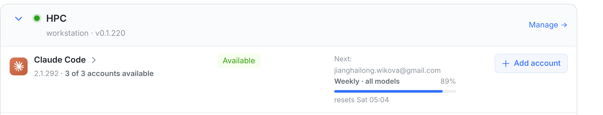

# 展开/收起的倒三角：挪到最左 + 用账号池那种小三角（效果图，代码还没提交）

Providers → “On your runners”。真机截图（本机 vite + 假 API，数据照你截图里的机器造的）。
按你的三条意见做的：**手机不挪、接受 28px 缩进、倒三角用账号池的风格**。

## ① 今天：倒三角在最右，位置跟着摘要走

它是按钮（`.re-toggle`）的最后一个元素，摘要和 `Manage →` 在按钮外面，所以它的 x =
卡片右边 − 摘要宽度 − Manage 宽度。每行摘要不一样长，就不在同一列：

| 行 | 摘要 | 倒三角 left (px) |
|---|---|---|
| wikova | All signed in | 1116 |
| workstation | 1 of 4 signed in | 1099 |
| longdeMac-mini.local | 0 of 3 signed in | 1096 |
| HPC（展开） | — | 1186 |
| ThinkPad（离线） | Offline + 1 of 3 signed in | 1039 |

最左和最右差 **147px**。

## ② 建议：挪到整行最左，用账号池的三角

| 行 | 摘要 | 倒三角 left (px) |
|---|---|---|
| wikova | All signed in | 425 |
| workstation | 1 of 4 signed in | 425 |
| longdeMac-mini.local | 0 of 3 signed in | 425 |
| HPC（展开） | — | 425 |
| ThinkPad（离线） | Offline + 1 of 3 signed in | 425 |

（展开行量到的 427 是转 90° 之后的包围盒，不是位置差。图上下面那张账号池卡片就是“倒三角领行”的参照。）

**两个标记爬上名字那一行**（2026-10-08 追加）：身份区是「名字 + 主机/版本」两行，而标记原来
居中于整块（竖直中心 197.4px），正好落在两行之间的缝里 —— 看起来跟哪一行都不搭。现在它们跟名字
同一根线（中心 186.5 / 186.2 / 186.7），并按尺寸一栏调过重量：

| | 名字行中心 | 圆点中心 | 倒三角中心 |
|---|---|---|---|
| 改前 | 186.5 | **197.4**（缝里） | **197.4**（缝里） |
| 改后（C） | 186.5 | 186.2 | 186.7 |

尺寸（对照 [05-leading-marks-plate](05-leading-marks-plate.png) 里那六版选的 C）：

| | 改前 | 改后 |
|---|---|---|
| 倒三角 | 20px、描边 2 | **16px、描边 2.2**（同一列 28px，位置与图标列对齐不变） |
| 圆点 | 7px、无光环 | **9px + 2.5px 同色 20% 光环**（在线绿、离线灰用各自颜色） |

头部和它下面第一行仍共用一列 —— 倒三角在引擎图标的上面，状态圆点在引擎名字的上面：

三个理由（倒三角为什么该领行）：

1. **这个产品的行尾表示「去别处」**——`Manage →`、引擎行的 `›`。同一页另外两处折叠控件都不在行尾：
   账号池卡片的 `▸` 在整行最左（就是它），引擎行的 `›` 紧跟引擎名。
2. **位置天生固定**：它在第一列，和摘要、和 Manage 的宽度都无关 —— 这类错位不可能再发生。
3. **和卡片自己的行共用一个栅格**：倒三角 425 = 引擎图标列 425，机器状态圆点 463 = 引擎名字列 463
   （这就是你接受的 28px 缩进换来的：机器名右移 28px，换来头部和它下面几行同一套列）。

## 手机：位置不动

卡片高度、摘要位置（名字下面缩进 17px）、`Manage →` 那一行**和今天逐像素一样**
（都是 101px 高，Manage 的纵坐标一模一样），倒三角仍在右上角。做法是 ≤600px 时
给它 `order: 2`，把它排回按钮末尾：一行 CSS。

尺寸和「对齐名字行」这两条在手机上同样成立（手机本来就把标记对齐第一行）。

## 要改什么

- `src/web/src/components/RunnerEngines.tsx`：倒三角那个 span 从按钮末尾挪到按钮开头（圆点前面），
  并把 svg 从 `20px` / `strokeWidth 2` 改成 `16px` / `2.2`。
- `src/web/src/index.css`：
  - `.re-runner-card .re-toggle` 加 `align-items: flex-start`（标记对齐名字行）；
  - `.re-dot` 7px → 9px、加 `margin-top: 7px` 和同色光环（`.re-dot.on` 用绿色）；
  - ≤600px 容器查询里 `.re-runner-card .re-chev { order: 2 }`（手机不挪的关键），
    并删掉那里多余的圆点 `margin-top` 规则。

不改：摘要、点击区域（整行仍可点）、aria、离线/警告摘要的样式。

## 落地时定的四条

1. 倒三角放在**最左**，不再跟着摘要跑。
2. **手机不挪**：≤600px 仍在右上角（`order: 2`），卡片高度、摘要位置、Manage 那行都不变。
3. 标记**对齐名字那一行**（不再卡在名字与版本之间）。
4. 尺寸：倒三角 16px / 描边 2.2，圆点 9px 带 2.5px 同色光环；颜色沿用原来的
   （倒三角 `--text-2`、hover·展开品牌蓝；圆点在线绿、离线灰）。

（中途曾经按“账号池那种小三角”改过一版并上线 —— 理解错了，已改回线条箭头。）

复现：`/var/tmp/runner-chev-shots/`（`server-chev.mjs` 假 API :3481、`vite.config.mjs` :5481、
`measure.mjs` 量位置与截图；`variants.mjs` 出尺寸版、`align/` 下是四版对齐图）。
